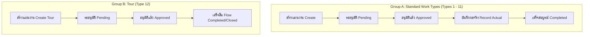

# Activity Plans (Trip Plan) Data Architecture Specification

> **Document Version:** 2.1.0 (Production Architecture Standard)  
> **Status:** ACTIVE STANDARD (ADOPTED SINGLE SOURCE OF TRUTH)  
> **Target Scope:** Module `modules/activity-plans/` and database tables `activity_*`

---

## 1. Current Architecture & Discovery Summary (A)

ระบบ Activity Plans (Trip Plan) ในปัจจุบันถูกสร้างขึ้นเพื่อบันทึกและจัดการแผนการทำงานของพนักงานขาย/ส่งเสริมการเกษตร (Field Sales / Agronomists) ครอบคลุม 12 ประเภทงาน (Work Types 1–12) 

### โครงสร้างเลเยอร์ปัจจุบัน:
- **Database:** Prisma ORM บน PostgreSQL มีตาราง `activity_types`, `activity_plans`, `activity_plan_items`, `activity_helpers`, `activity_results`, และ `activity_approval_logs`
- **Application Services & Repositories:** อยู่ใน `modules/activity-plans/infrastructure/` และ `modules/activity-plans/server/actions.ts`
- **Presentation:** Form (`activity-plan-form.tsx`), List Table (`activity-plan-table.tsx`), Detail View (`activity-plan-detail-view.tsx`), Actual View (`activity-plan-actual-view.tsx`)

---

## 2. Problems & Root Cause Analysis (B)

จากการตรวจสอบ Source Code และ Database จริง พบจุดบกพร่องเชิงสถาปัตยกรรม 10 ประการ:

1. **ขาด Single Source of Truth (SSOT) สำหรับ Work Types:**
   - ใช้ String Name เช่น `"เข้าพบร้านค้า / Key Farmer"` และ Array Index (`WORK_TYPES[0]`) ในการระบุประเภทงาน
   - UI, Form, Backend, Seed, Extractor ต่างมี Logic และ Hardcoded Mapping ของตนเอง
2. **Polymorphic Overloaded Table (`activity_plan_items`):**
   - รวมฟิลด์เฉพาะของทุกประเภทงาน (12 Work Types) ไว้ในตารางเดียว (เช่น `saleQuantity`, `storeQuantityCases`, `plotAreaRai`, `surveyCompetitorProduct`, `visitTopic`) ทำให้เกิดคอลัมน์ NULL จำนวนมาก และไม่มี Foreign Key ไปยัง Master Data ที่แท้จริง
3. **เก็บ Foreign Key สำคัญเป็น Free Text String:**
   - ร้านค้าถูกเก็บเป็น `customerName: String` (บางครั้งคั่นด้วย comma `"ร้าน A, ร้าน B"`) แทน `customerId`
   - สินค้าถูกเก็บเป็น `saleProductName: String`, `storeProductName: String` แทน `productId`
4. **`ActivityResult.resultSummary` ถูกใช้เป็น Primary Business Database:**
   - ผลการปฏิบัติงานจริง (Actual Sales, Actual Stock, Competitor Price, รูปภาพ) ถูก Serialize เป็น JSON String ขนาดใหญ่ยัดลงในฟิลด์ข้อความเดียว `resultSummary`
   - **ไม่สามารถเขียน SQL `SUM()`, `GROUP BY`, `JOIN` เพื่อทำ Report/Dashboard ได้**
5. **Heuristic & Regex Plan Extraction (`plan-extractor.ts`):**
   - เนื่องจาก `ActivityPlan` เก็บ `activityTypeId` ได้เพียง 1 ค่า เมื่อแผนงานมีหลายประเภทงาน ระบบจึงต้องใช้ Regex ค้นหาข้อความใน `objective` และเขียนเงื่อนไขคาดเดา เช่น:
     ```ts
     if (item.visitTopic && item.visitTopic !== "FOLLOWUP" && ...) {
       detectedWorkTypes.add(WORK_TYPES[0]); // -> เดาว่าเป็น Type 1 อัตโนมัติ!
     }
     ```
     ทำให้กิจกรรมใหม่อย่าง **"ทัวร์" (`visitTopic: "ทัวร์กลาง"`) ถูก Heuristic เดาผิดเป็น "เข้าพบร้านค้า / Key Farmer"**
6. **Repository Fallback to TYPE_1:**
   - ใน `resolveActivityTypeId` เมื่อไม่พบ Code จะ Fallback ไปเอาประเภทงานแรกในตาราง ซึ่งคือ `TYPE_1`
7. **Coupling ระหว่าง Plan และ Actual ในทุก Work Type:**
   - ทุกกิจกรรมถูกบังคับให้มี Flow เดียวกัน ทั้งที่บางกิจกรรม (เช่น **"ทัวร์"**) มี Business Requirement ว่า **ไม่มีการบันทึกผลจริง (No Actual)**
8. **ระบบจัดเก็บรูปภาพขาด Relation ชัดเจน:**
   - URL รูปภาพถูกรวมอยู่ใน JSON String ของ `resultSummary` ทำให้ไม่สามารถค้นหารูปภาพตามร้านค้า สินค้า หรือหมวดหมู่ภาพได้
9. **ไม่สามารถเปรียบเทียบ Target vs Actual ได้โดยตรง:**
   - Target อยู่ใน `activity_plan_items` แต่ Actual อยู่ใน JSON String ใน `activity_results`
10. **ความเสี่ยงสูงเมื่อเพิ่ม Work Type ในอนาคต:**
    - การเพิ่ม Work Type ใหม่จะกระทบ Regex, Extractor, Parser, และ UI Dispatcher ทั่วทั้งระบบ

---

## 3. Proposed Architecture & Core Design Principles (C)

สถาปัตยกรรมใหม่ถูกออกแบบภายใต้ 8 หลักการสำคัญ:

1. **Single Source of Truth (SSOT):** กำหนด Work Type Configuration ผ่าน Constant/Enum กลางที่มีคุณสมบัติครบถ้วน (`code`, `name`, `hasActual`, `requiresApproval`, `hasStores`, `hasProducts`)
2. **Normalized Data Structure:** แยกข้อมูลเชิงสัมพันธ์ออกเป็นตารางลูกที่มี Foreign Key ชัดเจน (`storeId -> Customer`, `productId -> Product`)
3. **Plan $\neq$ Actual (Decoupled Plan vs Result):** แยกสิ่งที่วางแผน (`ActivityPlan*`) ออกจากสิ่งที่เกิดขึ้นจริง (`ActivityResult*`) เพื่อให้คำนวณ Variance ผ่าน SQL ได้ทันที
4. **Dedicated Work Type Models:** กิจกรรมที่มีข้อมูลเฉพาะตัวสูง (เช่น **"ทัวร์"**) จะมีตารางเฉพาะ (`ActivityPlanTour`) แทนการยัดลง Text String
5. **Normalized Attachment/Image Management:** มีตาราง `ActivityAttachment` เก็บ Metadata, Category, และ Relation กับ Activity/Result/Store/Product
6. **Zero Heuristics / Zero Regex Extraction:** ลบ `plan-extractor.ts` และการเดาข้อความทิ้งทั้งหมด Query จาก Relations โดยตรง
7. **Distinct Business Lifecycles:** รองรับทั้งกลุ่มที่มี Actual (`APPROVAL_AND_ACTUAL`) และกลุ่มที่ไม่มี Actual (`APPROVAL_ONLY` เช่น Tour)
8. **Report & Dashboard Native:** ออกแบบ Schema ให้รองรับ Standard SQL Aggregations (`SUM`, `COUNT`, `AVG`, `GROUP BY`, `JOIN`) 100%

---

## 4. Proposed Database Tables & Schema (D)

### 1. Master: Work Types
```prisma
model ActivityType {
  id               String   @id @default(cuid())
  code             String   @unique // "TYPE_1", "TYPE_2", ..., "TYPE_12"
  name             String   // "เข้าพบร้านค้า / Key Farmer", "ทัวร์", ฯลฯ
  shortName        String?  @map("short_name")
  description      String?
  sortOrder        Int      @default(0) @map("sort_order")
  hasActual        Boolean  @default(true) @map("has_actual")
  requiresApproval Boolean  @default(true) @map("requires_approval")
  isActive         Boolean  @default(true) @map("is_active")

  createdAt        DateTime @default(now()) @map("created_at")
  updatedAt        DateTime @updatedAt @map("updated_at")

  planWorkTypes    ActivityPlanWorkType[]

  @@map("activity_types")
}
```

### 2. Plan Header & Work Type Bridge
```prisma
model ActivityPlan {
  id                            String         @id @default(cuid())
  code                          String         @unique // "TP26080001"
  title                         String
  employeeId                    String         @map("employee_id")
  createdById                   String         @map("created_by_id")
  currentApproverEmployeeId     String?        @map("current_approver_employee_id")

  // Dates & Duration
  startDate                     DateTime       @map("start_date")
  endDate                       DateTime       @map("end_date")
  durationDays                  Int            @default(1) @map("duration_days")
  fiscalYear                    Int            @map("fiscal_year")
  fiscalMonth                   Int            @map("fiscal_month")
  fiscalQuarter                 Int            @map("fiscal_quarter")

  // Location Details
  location                      String         // รายละเอียดสถานที่
  province                      String?
  district                      String?

  // Budget Planning
  salesPromotionBudgetRequested Decimal?       @db.Decimal(15, 2) @map("sales_promotion_budget_requested")
  marketingBudgetRequested      Decimal?       @db.Decimal(15, 2) @map("marketing_budget_requested")
  totalBudgetRequested          Decimal        @default(0) @db.Decimal(15, 2) @map("total_budget_requested")
  salesPromotionBudgetApproved  Decimal?       @db.Decimal(15, 2) @map("sales_promotion_budget_approved")
  marketingBudgetApproved       Decimal?       @db.Decimal(15, 2) @map("marketing_budget_approved")
  totalBudgetApproved           Decimal?       @db.Decimal(15, 2) @map("total_budget_approved")

  // Workflow Status
  status                        ActivityStatus @default(DRAFT)
  salesPromotionApproved        Boolean?       @map("sales_promotion_approved")
  marketingApproved             Boolean?       @map("marketing_approved")
  salesManagerApproved          Boolean?       @map("sales_manager_approved")

  // UI/Human Read Summary (Non-SSOT snapshots)
  objectiveSummary              String?        @map("objective_summary")
  notes                         String?

  // Timestamps & Soft Delete
  submittedAt                   DateTime?      @map("submitted_at")
  approvedAt                    DateTime?      @map("approved_at")
  rejectedAt                    DateTime?      @map("rejected_at")
  cancelledAt                   DateTime?      @map("cancelled_at")
  createdAt                     DateTime       @default(now()) @map("created_at")
  updatedAt                     DateTime       @updatedAt @map("updated_at")
  deletedAt                     DateTime?      @map("deleted_at")

  // Relations (Core Modules)
  employee                      Employee       @relation("EmployeeActivityPlans", fields: [employeeId], references: [id], onDelete: Restrict)
  createdBy                     User           @relation("UserActivityPlans", fields: [createdById], references: [id], onDelete: Restrict)
  currentApprover               Employee?      @relation("EmployeeActivityApprovals", fields: [currentApproverEmployeeId], references: [id], onDelete: SetNull)

  // Sub-relations (Normalized)
  workTypes                     ActivityPlanWorkType[]
  stores                        ActivityPlanStore[]
  products                      ActivityPlanProduct[]
  tour                          ActivityPlanTour?
  items                         ActivityPlanItem[]
  helpers                       ActivityHelper[]
  approvalLogs                  ActivityApprovalLog[]
  result                        ActivityResult?
  attachments                   ActivityAttachment[]

  @@index([employeeId])
  @@index([status])
  @@index([fiscalYear, fiscalMonth])
  @@index([province])
  @@map("activity_plans")
}

model ActivityPlanWorkType {
  id             String       @id @default(cuid())
  activityPlanId String       @map("activity_plan_id")
  activityTypeId String       @map("activity_type_id")

  activityPlan   ActivityPlan @relation(fields: [activityPlanId], references: [id], onDelete: Cascade)
  activityType   ActivityType @relation(fields: [activityTypeId], references: [id], onDelete: Restrict)

  @@unique([activityPlanId, activityTypeId])
  @@index([activityPlanId])
  @@index([activityTypeId])
  @@map("activity_plan_work_types")
}
```

### 3. Normalized Plan Detail Relations
```prisma
// ร้านค้าเป้าหมายในแผนงาน (เชื่อมต่อ Customer จริง)
model ActivityPlanStore {
  id             String       @id @default(cuid())
  activityPlanId String       @map("activity_plan_id")
  workTypeCode   String       @map("work_type_code") // e.g. "TYPE_1", "TYPE_11"
  storeId        String       @map("store_id")
  storeName      String?      @map("store_name") // Snapshot ณ วันที่สร้าง
  remarks        String?

  activityPlan   ActivityPlan @relation(fields: [activityPlanId], references: [id], onDelete: Cascade)
  store          Customer     @relation(fields: [storeId], references: [id], onDelete: Restrict)

  @@index([activityPlanId])
  @@index([storeId])
  @@index([workTypeCode])
  @@map("activity_plan_stores")
}

// สินค้าเป้าหมายในแผนงาน (เชื่อมต่อ Product จริง)
model ActivityPlanProduct {
  id             String       @id @default(cuid())
  activityPlanId String       @map("activity_plan_id")
  workTypeCode   String       @map("work_type_code") // e.g. "TYPE_3", "TYPE_9", "TYPE_11"
  storeId        String?      @map("store_id")
  productId      String       @map("product_id")
  productName    String?      @map("product_name") // Snapshot
  targetQuantity Int?         @map("target_quantity")
  unitPrice      Decimal?     @db.Decimal(15, 2) @map("unit_price")
  targetAmount   Decimal?     @db.Decimal(15, 2) @map("target_amount")

  activityPlan   ActivityPlan @relation(fields: [activityPlanId], references: [id], onDelete: Cascade)
  store          Customer?    @relation(fields: [storeId], references: [id], onDelete: SetNull)
  product        Product      @relation("ActivityPlanProductRef", fields: [productId], references: [id], onDelete: Restrict)

  @@index([activityPlanId])
  @@index([productId])
  @@index([storeId])
  @@index([workTypeCode])
  @@map("activity_plan_products")
}

// Dedicated Model: ทัวร์ (Work Type 12)
enum TourType {
  CENTRAL // ทัวร์กลาง
  STORE   // ทัวร์ร้านค้า
}

enum TourSize {
  SMALL // ทัวร์เล็ก
  LARGE // ทัวร์ใหญ่
}

model ActivityPlanTour {
  id             String       @id @default(cuid())
  activityPlanId String       @unique @map("activity_plan_id")
  tourType       TourType     @map("tour_type")
  tourSize       TourSize?    @map("tour_size")
  country        String?      @map("country")
  storeId        String?      @map("store_id")
  destination    String?      @map("destination")

  activityPlan   ActivityPlan @relation(fields: [activityPlanId], references: [id], onDelete: Cascade)
  store          Customer?    @relation(fields: [storeId], references: [id], onDelete: SetNull)

  @@index([tourType])
  @@index([country])
  @@index([storeId])
  @@map("activity_plan_tours")
}

// รายการเฉพาะอื่นๆ (Type 1 Visit Topic, Type 6 Issues, Type 7 Demo Plot Header, Type 8 Meeting Details)
model ActivityPlanItem {
  id               String       @id @default(cuid())
  activityPlanId   String       @map("activity_plan_id")
  workTypeCode     String       @map("work_type_code") // "TYPE_1", "TYPE_6", "TYPE_7", "TYPE_8"
  itemOrder        Int          @default(0) @map("item_order")
  
  // Structured Details
  topic            String?      @map("topic")
  detail           String?      @map("detail")
  issueType        String?      @map("issue_type")
  plotActivityType String?      @map("plot_activity_type")
  existingPlotId   String?      @map("existing_plot_id")
  attendeesCount   Int?         @map("attendees_count")

  activityPlan     ActivityPlan @relation(fields: [activityPlanId], references: [id], onDelete: Cascade)

  @@index([activityPlanId])
  @@index([workTypeCode])
  @@map("activity_plan_items")
}
```

### 4. Normalized Actual & Result Tables
```prisma
// ผลการปฏิบัติงานส่วนหัว (สร้างเฉพาะเมื่อมี Work Type ที่ hasActual = true)
model ActivityResult {
  id                   String                   @id @default(cuid())
  activityPlanId       String                   @unique @map("activity_plan_id")
  actualStartDate      DateTime                 @map("actual_start_date")
  actualEndDate        DateTime                 @map("actual_end_date")
  actualAttendeesCount Int?                     @map("actual_attendees_count")
  resultStatus         ActivityResultStatus     @default(COMPLETED) @map("result_status")
  
  // Qualitative Feedback
  discussionResult     String?                  @map("discussion_result")
  productAdvice        String?                  @map("product_advice")
  salesOpportunity     String?                  @map("sales_opportunity") // "สูง", "ต่ำ"
  problemFound         String?                  @map("problem_found")
  nextAction           String?                  @map("next_action")
  nextMeetingDate      DateTime?                @map("next_meeting_date")
  
  // Postponed / Cancel Reasons
  cancelReason         String?                  @map("cancel_reason")
  postponedDate        DateTime?                @map("postponed_date")
  postponedReason      String?                  @map("postponed_reason")

  // Human Readable Snapshot (Non-SSOT)
  resultSummary        String?                  @map("result_summary")

  createdAt            DateTime                 @default(now()) @map("created_at")
  updatedAt            DateTime                 @updatedAt @map("updated_at")

  activityPlan         ActivityPlan             @relation(fields: [activityPlanId], references: [id], onDelete: Cascade)
  
  // Normalized Result Items
  saleResults          ActivityResultSaleItem[]
  stockResults         ActivityResultStockItem[]
  surveyResults        ActivityResultSurveyItem[]
  demoResults          ActivityResultDemoItem[]
  attachments          ActivityAttachment[]

  @@index([activityPlanId])
  @@index([resultStatus])
  @@map("activity_results")
}

// ยอดขายจริงตามสินค้า/ร้านค้า (Type 3 Sales, Type 9 Store Promo, Type 10 Field Day)
model ActivityResultSaleItem {
  id               String         @id @default(cuid())
  activityResultId String         @map("activity_result_id")
  workTypeCode     String         @map("work_type_code") // "TYPE_3", "TYPE_9", "TYPE_10"
  storeId          String?        @map("store_id")
  productId        String         @map("product_id")
  productName      String?        @map("product_name")
  actualQuantity   Int            @map("actual_quantity")
  actualUnitPrice  Decimal        @db.Decimal(15, 2) @map("actual_unit_price")
  actualTotal      Decimal        @db.Decimal(15, 2) @map("actual_total")
  unclosedReason   String?        @map("unclosed_reason")

  activityResult   ActivityResult @relation(fields: [activityResultId], references: [id], onDelete: Cascade)
  store            Customer?      @relation(fields: [storeId], references: [id], onDelete: SetNull)
  product          Product        @relation("ActivityResultSaleProductRef", fields: [productId], references: [id], onDelete: Restrict)

  @@index([activityResultId])
  @@index([productId])
  @@index([storeId])
  @@index([workTypeCode])
  @@map("activity_result_sale_items")
}

// ผลการตรวจเช็กสต็อกจริง (Type 11 Stock Check)
model ActivityResultStockItem {
  id                  String         @id @default(cuid())
  activityResultId    String         @map("activity_result_id")
  storeId             String         @map("store_id")
  productId           String         @map("product_id")
  remainingQuantity   Int            @default(0) @map("remaining_quantity")
  stockStatus         String?        @map("stock_status") // "ปกติ", "ใกล้หมด", "ของขาด"
  reorderOpportunity  String?        @map("reorder_opportunity") // "สูง", "ต่ำ"
  remarks             String?

  activityResult      ActivityResult @relation(fields: [activityResultId], references: [id], onDelete: Cascade)
  store               Customer       @relation(fields: [storeId], references: [id], onDelete: Restrict)
  product             Product        @relation("ActivityResultStockProductRef", fields: [productId], references: [id], onDelete: Restrict)

  @@index([activityResultId])
  @@index([storeId])
  @@index([productId])
  @@map("activity_result_stock_items")
}

// ผลการสำรวจตลาดคู่แข่ง (Type 5 Market Survey)
model ActivityResultSurveyItem {
  id                String         @id @default(cuid())
  activityResultId  String         @map("activity_result_id")
  storeId           String         @map("store_id")
  productId         String?        @map("product_id") // สินค้าของเราที่เทียบ
  competitorBrand   String         @map("competitor_brand")
  competitorProduct String         @map("competitor_product")
  competitorPrice   Decimal?       @db.Decimal(15, 2) @map("competitor_price")
  competitorUnit    String?        @map("competitor_unit")
  promotionDetail   String?        @map("promotion_detail")

  activityResult    ActivityResult @relation(fields: [activityResultId], references: [id], onDelete: Cascade)
  store             Customer       @relation(fields: [storeId], references: [id], onDelete: Restrict)
  product           Product?       @relation("ActivityResultSurveyProductRef", fields: [productId], references: [id], onDelete: SetNull)

  @@index([activityResultId])
  @@index([storeId])
  @@index([competitorBrand])
  @@map("activity_result_survey_items")
}

// ผลการติดตามแปลงสาธิต (Type 7 Demo Plot)
model ActivityResultDemoItem {
  id                 String         @id @default(cuid())
  activityResultId   String         @map("activity_result_id")
  demoPlotId         String?        @map("demo_plot_id")
  cropAgeValue       String?        @map("crop_age_value")
  cropAgeUnit        String?        @map("crop_age_unit")
  growthStage        String?        @map("growth_stage")
  cropCondition      String?        @map("crop_condition") // "สมบูรณ์", "มีปัญหา"
  productResponse    String?        @map("product_response")
  problemDescription String?        @map("problem_description")
  finalYieldKg       Decimal?       @db.Decimal(10, 2) @map("final_yield_kg")
  controlYieldKg     Decimal?       @db.Decimal(10, 2) @map("control_yield_kg")
  satisfactionScore  Int?           @map("satisfaction_score")

  activityResult     ActivityResult @relation(fields: [activityResultId], references: [id], onDelete: Cascade)

  @@index([activityResultId])
  @@index([demoPlotId])
  @@map("activity_result_demo_items")
}

// คลังรูปภาพและเอกสารแนบ (Normalized Attachments)
enum AttachmentCategory {
  PRICE_TAG   // ป้ายราคาคู่แข่ง
  SHELF       // ชั้นวางสินค้า
  CROP        // ต้นพืช/ผลผลิต
  PLOT        // ภาพรวมแปลง
  ATMOSPHERE  // บรรยากาศงานประชุม/หน้าร้าน
  ISSUE       // รูปปัญหา/ข้อร้องเรียน
  GENERAL     // อื่นๆ
}

model ActivityAttachment {
  id               String              @id @default(cuid())
  activityPlanId   String              @map("activity_plan_id")
  activityResultId String?             @map("activity_result_id")
  workTypeCode     String?             @map("work_type_code")
  storeId          String?             @map("store_id")
  productId        String?             @map("product_id")
  category         AttachmentCategory  @default(GENERAL)
  fileUrl          String              @map("file_url")
  fileName         String              @map("file_name")
  fileSize         Int?                @map("file_size")
  mimeType         String?             @map("mime_type")
  createdAt        DateTime            @default(now()) @map("created_at")

  activityPlan     ActivityPlan        @relation(fields: [activityPlanId], references: [id], onDelete: Cascade)
  activityResult   ActivityResult?     @relation(fields: [activityResultId], references: [id], onDelete: Cascade)
  store            Customer?           @relation(fields: [storeId], references: [id], onDelete: SetNull)
  product          Product?            @relation("ActivityAttachmentProductRef", fields: [productId], references: [id], onDelete: SetNull)

  @@index([activityPlanId])
  @@index([activityResultId])
  @@index([category])
  @@index([storeId])
  @@index([productId])
  @@map("activity_attachments")
}
```

---

## 5. Work Type Matrix & Configuration (F)

ตาราง Work Type ทั้งหมดที่ถูกกำหนดเป็น **Single Source of Truth** ในระบบ:

| Work Type Code | ชื่อประเภทงาน | Has Actual | Requires Approval | Stores Relation | Products Relation | Dedicated Model |
|:---|:---|:---:|:---:|:---:|:---:|:---|
| `TYPE_1` | เข้าพบร้านค้า / Key Farmer | **Yes** | **Yes** | 1 Store | Optional | `ActivityPlanItem` |
| `TYPE_2` | ติดตามผลการใช้สินค้า | **Yes** | **Yes** | 1 Store | 1 Product | `ActivityPlanProduct` |
| `TYPE_3` | เสนอขายสินค้า | **Yes** | **Yes** | 1 Store | Multiple Products | `ActivityPlanProduct`, `ActivityResultSaleItem` |
| `TYPE_4` | วางบิล / เก็บเงิน | **Yes** | **Yes** | 1 Store | Optional | `ActivityPlanItem` |
| `TYPE_5` | สำรวจตลาดของคู่แข่ง | **Yes** | **Yes** | Multiple Stores | Multiple Products | `ActivityResultSurveyItem`, `ActivityAttachment` |
| `TYPE_6` | แก้ปัญหา / รับเรื่องร้องเรียน | **Yes** | **Yes** | 1 Store | Optional | `ActivityPlanItem`, `ActivityAttachment` |
| `TYPE_7` | ติดตามแปลงสาธิต / ทำแปลง | **Yes** | **Yes** | Optional | 1 Product | `ActivityResultDemoItem`, `ActivityAttachment` |
| `TYPE_8` | จัดประชุมการเกษตร / ดีลเลอร์ | **Yes** | **Yes** | Multiple Stores | Optional | `ActivityPlanItem` |
| `TYPE_9` | จัดกิจกรรมส่งเสริมการขายหน้าร้าน | **Yes** | **Yes** | 1 Store | Multiple Products | `ActivityPlanProduct`, `ActivityResultSaleItem` |
| `TYPE_10` | จัดงาน Field Day | **Yes** | **Yes** | Optional | Optional | `ActivityPlanItem`, `ActivityResultSaleItem` |
| `TYPE_11` | ตรวจเช็กสต็อกหน้าร้าน | **Yes** | **Yes** | Multiple Stores | Multiple Products | `ActivityPlanStore`, `ActivityResultStockItem` |
| `TYPE_12` | **ทัวร์ (Tour)** | **No** | **Yes** | Optional Store | **No Product** | **`ActivityPlanTour`** |

---

## 6. Business Lifecycle Specification (G)

ระบบแบ่ง Lifecycle ของกิจกรรมออกเป็น 2 รูปแบบชัดเจน:



### กฎของ Tour (Type 12):
1. `hasActual = false`: ไม่มี `ActivityResult`, ไม่มีปุ่ม "บันทึกผล" ใน List Table และ Detail View
2. หน้า Detail View จะเรนเดอร์เฉพาะ `DetailType12Tour` และ **ไม่เรนเดอร์ Section "ผลการปฏิบัติงานตามประเภทงาน"**
3. มี Approval Flow เหมือนกิจกรรมอื่นๆ ทุกประการ

---

## 7. Tour Data Model Specifics (H)

โครงสร้างข้อมูลของทัวร์ถูกจัดเก็บในตาราง `ActivityPlanTour` อย่างเป็นสัดส่วน:

- **กรณี "ทัวร์กลาง":**
  - `tourType` = `CENTRAL`
  - `tourSize` = `SMALL` หรือ `LARGE` (Required)
  - `country` = ชื่อประเทศ (Required เช่น "ญี่ปุ่น", "เกาหลีใต้")
  - `storeId` = `NULL`
  - `destination` = `NULL`
- **กรณี "ทัวร์ร้านค้า":**
  - `tourType` = `STORE`
  - `storeId` = Foreign Key ชี้ไปที่ `Customer.id` (Required)
  - `destination` = ชื่อสถานที่ เช่น "โรงงาน ABC จ.ชลบุรี" (Required)
  - `tourSize` = `NULL`
  - `country` = `NULL`

---

## 8. Report Readiness & Analytics Capability (I)

ด้วย Normalized Schema ใหม่ ทำให้ SQL Query สามารถตอบคำถามทางธุรกิจได้โดยตรง 100%:

### 1. เปรียบเทียบ Target Sales vs Actual Sales รายสินค้า
```sql
SELECT 
    p.name AS product_name,
    COALESCE(SUM(target.target_amount), 0) AS total_target_sales,
    COALESCE(SUM(actual.actual_total), 0) AS total_actual_sales,
    (COALESCE(SUM(actual.actual_total), 0) - COALESCE(SUM(target.target_amount), 0)) AS variance_sales
FROM products p
LEFT JOIN activity_plan_products target ON target.product_id = p.id
LEFT JOIN activity_result_sale_items actual ON actual.product_id = p.id
GROUP BY p.id, p.name
ORDER BY total_actual_sales DESC;
```

### 2. สรุปผลการตรวจเช็กสต็อกหน้าร้าน (Stock Health Report)
```sql
SELECT 
    c.name AS store_name,
    p.name AS product_name,
    stock.remaining_quantity,
    stock.stock_status,
    stock.reorder_opportunity,
    ar.actual_start_date AS check_date
FROM activity_result_stock_items stock
JOIN activity_results ar ON ar.id = stock.activity_result_id
JOIN customers c ON c.id = stock.store_id
JOIN products p ON p.id = stock.product_id
WHERE stock.stock_status IN ('ใกล้หมด', 'ของขาด');
```

### 3. สรุปกิจกรรมทัวร์แยกตามประเทศและประเภททัวร์
```sql
SELECT 
    t.tour_type,
    COALESCE(t.country, c.name) AS destination_or_store,
    COUNT(ap.id) AS total_plans,
    ap.status
FROM activity_plan_tours t
JOIN activity_plans ap ON ap.id = t.activity_plan_id
LEFT JOIN customers c ON c.id = t.store_id
GROUP BY t.tour_type, t.country, c.name, ap.status;
```

---

## 9. Dashboard Readiness (J)

| Dashboard Widget | Data Source (New Normalized Tables) | Calculation / Metric |
|---|---|---|
| **Activity Status Overview** | `activity_plans` | `COUNT(id) GROUP BY status` |
| **Work Type Breakdown** | `activity_plan_work_types` JOIN `activity_types` | `COUNT(activity_plan_id) GROUP BY code` |
| **Sales Target vs Actual** | `activity_plan_products` & `activity_result_sale_items` | `SUM(target_amount)` vs `SUM(actual_total)` |
| **Top 10 Stores Visited** | `activity_plan_stores` JOIN `customers` | `COUNT(activity_plan_id) GROUP BY store_id` |
| **Competitor Price Monitor** | `activity_result_survey_items` | `AVG(competitor_price) GROUP BY competitor_product` |
| **Low Stock Alerts** | `activity_result_stock_items` | `COUNT(id) WHERE stock_status = 'ของขาด'` |
| **Tour Destination Distribution** | `activity_plan_tours` | `COUNT(id) GROUP BY country` |

---

## 10. Migration & Execution Safety Plan (K)

### กฎความปลอดภัยของระบบฐานข้อมูล (Zero Data Loss for Other Modules):
1. **ห้ามใช้ `prisma migrate reset`** เด็ดขาด
2. **ห้ามใช้ `prisma db push`** ในโหมดลบตารางหลัก
3. **ห้ามแตะต้องตารางของ Module อื่น** (`users`, `employees`, `customers`, `products`, `sales`, `inventory`)
4. **การจัดการ Test Data ของ Activity:**
   - เนื่องจากระบบยังอยู่ในขั้นพัฒนา (Pre-production) สามารถเขียน Migration Script ที่สร้างตารางใหม่ `activity_*` และเคลียร์เฉพาะตาราง `activity_*` ได้อย่างปลอดภัย
5. **ขั้นตอนการ Execute Migration:**
   - Backup Schema & Data ปัจจุบัน
   - ปรับ `prisma/schema.prisma`
   - รัน `npx prisma migrate dev --name rebuild_activity_plans_architecture`
   - รัน Seed Work Types 1-12 ด้วย `npx tsx prisma/seed/activity/index.ts`

---

## สรุปข้อเปรียบเทียบและการตัดสินใจ (Comparison & Recommendation)

| มิติการเปรียบเทียบ | OPTION A: Patch สถาปัตยกรรมเดิม | OPTION B: รื้อและใช้ Normalized Data Architecture (แนะนำ) |
|---|---|---|
| **โครงสร้างข้อมูล** | ใช้ JSON String ใน `resultSummary` ตามเดิม | Normalized Tables แยก Plan, Actual, Store, Product, Tour |
| **ความพร้อมด้าน Report/BI** | ❌ ทำได้ยากมาก (ต้อง Parse JSON/Regex ทุกรอบ) | ✅ พร้อมทำ SQL Analytics / Aggregations 100% |
| **ความถูกต้องของ Tour** | ⚠️ ต้องใช้ if/else และ Regex ดักจับหลายจุด | ✅ มี Model `ActivityPlanTour` และ `hasActual = false` ในตัว |
| **ความเสี่ยงการเกิด Bug ซ้ำ** | ⚠️ สูง เมื่อเพิ่ม Work Type ใหม่ในอนาคต | 🟢 ต่ำมาก เนื่องจากใช้ Single Source of Truth และ Strongly Typed |
| **ความเหมาะสมกับจังหวะเวลา** | เหมาะกับการแก้ด่วนหลังขึ้น Production | **เหมาะสมที่สุด เนื่องจากระบบยังไม่ขึ้น Production** |

> **คำแนะนำ:** ให้ดำเนินการตาม **OPTION B (Rebuild Activity Plans Data Architecture)** เพื่อให้ระบบได้มาตรฐาน Enterprise-grade รองรับการเติบโตและ Analytics ในอนาคตอย่างแท้จริง
