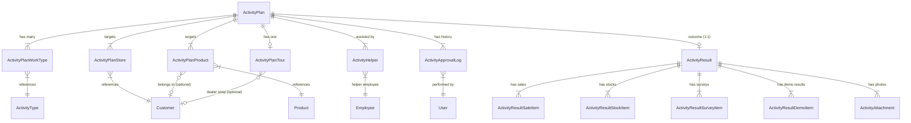

# Activity Plans Data Flow Audit

> **Audit Date:** 28 สิงหาคม 2026  
> **Target Module:** `modules/activity-plans/`  
> **Audit Type:** Full Architectural & Relational Data Flow Audit (Read-Only)  
> **Database Engine:** PostgreSQL (Prisma ORM 7 with `@prisma/adapter-pg`)  
> **Architecture Pattern:** Activity Plans Normalized Relational Architecture

---

## 1. Architecture Overview

โมดูล `modules/activity-plans/` ได้รับการออกแบบตามสถาปัตยกรรม **Activity Plans Normalized Relational Architecture** โดยแบ่งแยกความรับผิดชอบออกเป็น 4 เลเยอร์หลักตามมาตรฐาน `CRM Coding Standards`:

```
┌─────────────────────────────────────────────────────────────────────────────┐
│ 1. Features Layer (UI & Client Views)                                       │
│    modules/activity-plans/features/                                         │
│    ├── form/                → หน้าสร้าง/แก้ไข Trip Plan (Client State)       │
│    ├── detail-view/         → หน้ารายละเอียดแผนและผลงาน (Read-Only)          │
│    ├── actual-view/         → หน้าบันทึกผลการปฏิบัติงานจริง (Actual View)    │
│    ├── list-view/           → หน้ารายการแผนงานและตารางค้นหา                  │
│    ├── approve-view/        → หน้าอนุมัติแผนงานตามลำดับขั้น                  │
│    └── promotional-materials/ → จัดการสื่อส่งเสริมการขาย                    │
└──────────────────────────────────────┬──────────────────────────────────────┘
                                       │ calls Server Actions
                                       ▼
┌─────────────────────────────────────────────────────────────────────────────┐
│ 2. Server Layer (Transport & Actions)                                       │
│    modules/activity-plans/server/actions.ts                                 │
│    ├── Auth & Session Verification (`auth()`)                               │
│    ├── Permission Checks (`activity.create`, `activity.edit`, etc.)         │
│    └── Cache Revalidation (`revalidatePath()`)                              │
└──────────────────────────────────────┬──────────────────────────────────────┘
                                       │ invokes Use Cases
                                       ▼
┌─────────────────────────────────────────────────────────────────────────────┐
│ 3. Application Layer (Business Logic & Validations)                         │
│    modules/activity-plans/application/                                      │
│    ├── validations.ts       → Zod Schemas (`activityPlanSchema`, etc.)      │
│    ├── index.ts             → Facade Use Cases (`createActivityPlanUseCase`)│
│    ├── activity-plan-flow.ts→ State Machine & Approval Workflow Transitions │
│    └── demo-plots.ts / approval-queue.ts / promotional-materials.ts         │
└──────────────────────────────────────┬──────────────────────────────────────┘
                                       │ calls Repository
                                       ▼
┌─────────────────────────────────────────────────────────────────────────────┐
│ 4. Infrastructure Layer (Database & Prisma Transaction)                     │
│    modules/activity-plans/infrastructure/activity-plan.repository.ts        │
│    ├── Atomic DB Transactions (`db.$transaction`)                          │
│    ├── Normalized Table Mutations (INSERT/UPDATE/DELETE)                    │
│    └── Strict Soft-Delete Filtering (`where: { deletedAt: null }`)          │
└──────────────────────────────────────┬──────────────────────────────────────┘
                                       │ executes SQL
                                       ▼
┌─────────────────────────────────────────────────────────────────────────────┐
│ 5. Database Layer (PostgreSQL)                                              │
│    Normalized Tables: activity_plans, activity_plan_work_types,             │
│    activity_plan_stores, activity_plan_products, activity_helpers,          │
│    activity_results, activity_result_* items                                │
└─────────────────────────────────────────────────────────────────────────────┘
```

---

## 2. Work Type Master

ประเภทงานทั้ง 12 ประเภทถูกนิยามเป็น Master Data ในตาราง `activity_types` และมีคู่ขนาน Configuration ใน `modules/activity-plans/constants.ts` ดังนี้:

| Code | ชื่อภาษาไทย (Master Name) | Short Name | Sort Order | hasActual | requiresApproval |
|---|---|---|:---:|:---:|:---:|
| `TYPE_1` | เข้าพบร้านค้า / Key Farmer | Visit | 1 | `true` | `true` |
| `TYPE_2` | ติดตามผลการใช้สินค้า | Followup | 2 | `true` | `true` |
| `TYPE_3` | เสนอขายสินค้า | Sales | 3 | `true` | `true` |
| `TYPE_4` | วางบิล / เก็บเงิน | Collect | 4 | `true` | `true` |
| `TYPE_5` | สำรวจตลาดของคู่แข่ง | Survey | 5 | `true` | `true` |
| `TYPE_6` | แก้ปัญหา / รับเรื่องร้องเรียน | Issue | 6 | `true` | `true` |
| `TYPE_7` | ติดตามแปลงสาธิต / ทำแปลง | Demo | 7 | `true` | `true` |
| `TYPE_8` | จัดประชุมการเกษตร / ดีลเลอร์ / ซับดีลเลอร์ | Meeting | 8 | `true` | `true` |
| `TYPE_9` | จัดกิจกรรมส่งเสริมการขายหน้าร้าน | Store | 9 | `true` | `true` |
| `TYPE_10` | จัดงาน Field Day | FieldDay | 10 | `true` | `true` |
| `TYPE_11` | ตรวจเช็กสต็อกหน้าร้าน | Stock | 11 | `true` | `true` |
| `TYPE_12` | ทัวร์ | Tour | 12 | `false` | `true` |

---

## 3. TYPE_1 Definition ("เข้าพบร้านค้า / Key Farmer")

จากการตรวจสอบ Source Code และฐานข้อมูลจริง:
- **ชื่อประเภทงาน:** `เข้าพบร้านค้า / Key Farmer`
- **Work Type Code:** `TYPE_1`
- **Short Name:** `Visit`
- **ActivityType ID (จากฐานข้อมูลจริง):** `cmtbbeima00004so95oic9jmi`
- **hasActual:** `true` (ต้องมีการบันทึกผลการปฏิบัติงานจริงหลังทำกิจกรรม)
- **requiresApproval:** `true` (ต้องผ่านขั้นตอนการอนุมัติตามสายงาน)
- **Source of Truth:** ตาราง `activity_plan_work_types` (เชื่อมโยงแบบ Many-to-Many ผ่าน `activity_type_id`)

---

## 4. Create Trip Plan Flow (สำหรับ TYPE_1)

เมื่อผู้ใช้สร้างแผนงานประเภท `เข้าพบร้านค้า / Key Farmer` ข้อมูลจะถูกประมวลผลตามขั้นตอนดังต่อไปนี้:

```
[UI Form: Type1Visit Component]
  │  (ผู้ใช้เลือกวันเวลา, วัตถุประสงค์, ร้านค้า, ประเด็นเข้าพบ, ผู้ช่วย)
  ▼
[React State ใน activity-plan-form.tsx]
  │  - selectedWorkTypes = ["เข้าพบร้านค้า / Key Farmer"]
  │  - type1Items = [{ customerName: "...", topic: "...", detail: "..." }]
  │  - helperEmployeeIds = ["emp_1", "emp_2"]
  │  - startDate / startTime, endDate / endTime
  ▼
[Payload Assembly ใน handleSubmit()]
  │  - planStores = [{ workTypeCode: "TYPE_1", storeId: match.id, storeName: match.name, remarks: item.topic }]
  │  - workTypeCodes = ["TYPE_1"]
  │  - helperEmployeeIds = [...]
  │  - items = [{ itemType: "TYPE_1", customerName: "...", visitTopic: "...", detail: "..." }]
  ▼
[Server Action: createActivityPlanAction()] (modules/activity-plans/server/actions.ts)
  │  - ตรวจสอบ session ด้วย auth()
  │  - ตรวจสอบสิทธิ์ "activity.create" หรือ "activity.manage"
  ▼
[Application Use Case: createActivityPlanUseCase()] (modules/activity-plans/application/index.ts)
  │  - ตรวจสอบ Validation ผ่าน activityPlanSchema.safeParse(rawData)
  │  - หาหรือสร้าง Employee Profile (findOrCreateEmployeeForUser)
  ▼
[Repository: createActivityPlan()] (modules/activity-plans/infrastructure/activity-plan.repository.ts)
  │  - เริ่มต้น db.$transaction
  │  - Auto-generate รหัสแผน (เช่น TP26080003)
  │  - คำนวณ Fiscal Dimensions (fiscalYear, fiscalMonth, fiscalQuarter, durationDays)
  ▼
[Database Mutations ใน Transaction]
  ├── 1. INSERT INTO activity_plans (ข้อมูลหลักของแผน)
  ├── 2. INSERT INTO activity_plan_work_types (ผูก TYPE_1 กับ activity_types)
  ├── 3. INSERT INTO activity_plan_stores (บันทึกรายชื่อร้านค้าตามจำนวนที่เลือก)
  ├── 4. INSERT INTO activity_helpers (บันทึกผู้ช่วยงานตามจำนวนคนที่เลือก)
  ├── 5. INSERT INTO activity_plan_items (บันทึก Backward-Compatibility items)
  └── 6. INSERT INTO activity_approval_logs (บันทึก Log เริ่มต้นสถานะ SUBMIT)
```

---

## 5. Database Tables

ตารางทั้งหมดในฐานข้อมูลที่เกี่ยวข้องกับโมดูล Activity Plans มีรายละเอียดโครงสร้างดังนี้:

| Prisma Model | Database Table | หน้าที่ | Primary Key | Foreign Keys | Relations ไปยังตารางอื่น |
|---|---|---|---|---|---|
| `ActivityType` | `activity_types` | Master ประเภทงาน 12 แบบ | `id` (cuid) | - | `ActivityPlan`, `ActivityPlanWorkType` |
| `ActivityPlan` | `activity_plans` | ข้อมูลหลักของ Trip Plan | `id` (cuid) | `employee_id`<br>`created_by_id`<br>`current_approver_employee_id`<br>`activity_type_id` | `Employee` (ผู้สร้าง)<br>`User` (บัญชีผู้สร้าง)<br>`Employee` (ผู้อนุมัติ)<br>`ActivityType` (Primary Type) |
| `ActivityPlanWorkType` | `activity_plan_work_types` | Relation ประเภทงานของแต่ละแผน (Source of Truth) | `id` (cuid) | `activity_plan_id`<br>`activity_type_id` | `ActivityPlan` (Cascade)<br>`ActivityType` (Restrict) |
| `ActivityPlanStore` | `activity_plan_stores` | Relation ร้านค้า/ลูกค้าเป้าหมายในแผน | `id` (cuid) | `activity_plan_id`<br>`store_id` | `ActivityPlan` (Cascade)<br>`Customer` (Restrict) |
| `ActivityPlanProduct` | `activity_plan_products` | Relation สินค้าเป้าหมายในแผน (รองรับ Store Ownership) | `id` (cuid) | `activity_plan_id`<br>`store_id`<br>`product_id` | `ActivityPlan` (Cascade)<br>`Customer` (SetNull)<br>`Product` (Restrict) |
| `ActivityPlanTour` | `activity_plan_tours` | Relation รายละเอียดทัวร์ (TYPE_12) | `id` (cuid) | `activity_plan_id` (Unique)<br>`store_id` | `ActivityPlan` (Cascade)<br>`Customer` (SetNull) |
| `ActivityHelper` | `activity_helpers` | Relation ผู้ช่วยงานในแต่ละแผน | `id` (cuid) | `activity_plan_id`<br>`employee_id`<br>`approved_by_id` | `ActivityPlan` (Cascade)<br>`Employee` (Restrict)<br>`Employee` (SetNull) |
| `ActivityApprovalLog` | `activity_approval_logs` | ประวัติ Workflow การขออนุมัติและเปลี่ยนสถานะ | `id` (cuid) | `activity_plan_id`<br>`user_id` | `ActivityPlan` (Cascade)<br>`User` (Restrict) |
| `ActivityPlanItem` | `activity_plan_items` | ตารางรองรับข้อมูลย่อยแบบ Flat (Compatibility) | `id` (cuid) | `activity_plan_id` | `ActivityPlan` (Cascade) |
| `ActivityResult` | `activity_results` | ข้อมูลหลักของการบันทึกผลงานจริง (1:1 กับ Plan) | `id` (cuid) | `activity_plan_id` (Unique)<br>`recorded_by_id` | `ActivityPlan` (Cascade)<br>`User` (SetNull) |
| `ActivityResultSaleItem` | `activity_result_sale_items` | ยอดขายสินค้าจริงตามร้านค้า | `id` (cuid) | `activity_result_id`<br>`store_id`<br>`product_id` | `ActivityResult` (Cascade)<br>`Customer` (SetNull)<br>`Product` (Restrict) |
| `ActivityResultStockItem` | `activity_result_stock_items` | ผลการตรวจเช็กสต็อกสินค้าหน้าร้าน | `id` (cuid) | `activity_result_id`<br>`store_id`<br>`product_id` | `ActivityResult` (Cascade)<br>`Customer` (Restrict)<br>`Product` (Restrict) |
| `ActivityResultSurveyItem` | `activity_result_survey_items` | ผลการสำรวจราคาสินค้าคู่แข่ง | `id` (cuid) | `activity_result_id`<br>`store_id`<br>`product_id` | `ActivityResult` (Cascade)<br>`Customer` (Restrict)<br>`Product` (SetNull) |
| `ActivityResultDemoItem` | `activity_result_demo_items` | ผลการติดตามแปลงสาธิต | `id` (cuid) | `activity_result_id`<br>`demo_plot_id` | `ActivityResult` (Cascade)<br>`DemoPlot` |
| `ActivityAttachment` | `activity_attachments` | รูปภาพและไฟล์แนบของแผนและผลงาน | `id` (cuid) | `activity_plan_id`<br>`activity_result_id`<br>`store_id`<br>`product_id` | `ActivityPlan` (Cascade)<br>`ActivityResult` (Cascade)<br>`Customer` (SetNull)<br>`Product` (SetNull) |

---

## 6. Database Relationships



---

## 7. Store Data Flow (กรณีเลือกหลายร้านค้า)

### ตัวอย่าง: เลือก 2 ร้านค้า (ร้าน A และ ร้าน B)
เมื่อผู้ใช้เลือก 2 ร้านค้าในหน้าฟอร์ม:
1. **React State (`type1Items`):** เก็บ Object 2 รายการ
2. **Payload (`planStores`):**
   ```json
   [
     { "workTypeCode": "TYPE_1", "storeId": "cust_aaa", "storeName": "ร้าน A", "remarks": "แจ้งข่าวสาร" },
     { "workTypeCode": "TYPE_1", "storeId": "cust_bbb", "storeName": "ร้าน B", "remarks": "เยี่ยมเยียน" }
   ]
   ```
3. **Database Insertion:**
   - ตาราง `activity_plans`: **1 Record**
   - ตาราง `activity_plan_work_types`: **1 Record** (`TYPE_1`)
   - ตาราง `activity_plan_stores`: **2 Records**
     - Record 1: `{ id: "aps_1", activity_plan_id: "plan_1", store_id: "cust_aaa", work_type_code: "TYPE_1", remarks: "แจ้งข่าวสาร" }`
     - Record 2: `{ id: "aps_2", activity_plan_id: "plan_1", store_id: "cust_bbb", work_type_code: "TYPE_1", remarks: "เยี่ยมเยียน" }`

---

## 8. Product Data Flow (กรณีเลือกหลายสินค้า)

ตาราง `activity_plan_products` ถูกออกแบบให้รองรับความสัมพันธ์แบบ **Triple Key (Plan + Store + Product)**:

```
ActivityPlan
  ├── Store A (Customer ID: cust_aaa)
  │     ├── Product 1 (Product ID: prod_1)
  │     └── Product 2 (Product ID: prod_2)
  └── Store B (Customer ID: cust_bbb)
        ├── Product 1 (Product ID: prod_1)
        └── Product 2 (Product ID: prod_2)
```

- ฟิลด์ `store_id` ใน `activity_plan_products` เป็น Foreign Key ชี้ไปยัง `Customer.id` (Nullable เพื่อรองรับกรณีสินค้าเป้าหมายรวมระดับแผน)
- ฟิลด์ `product_id` ชี้ไปยัง `Product.id`
- ฟิลด์ `work_type_code` ระบุประเภทงาน (เช่น `TYPE_3`, `TYPE_9`, `TYPE_11`)
- **กรณีเลือก 2 ร้านค้า และ 2 สินค้าต่อร้าน:** จะเกิด Record ใน `activity_plan_products` ทั้งหมด **4 Records** แยกกันอย่างเป็นเอกเทศ

---

## 9. Helper Data Flow (กรณีเลือกผู้ช่วยหลายคน)

### ตัวอย่าง: เลือกผู้ช่วย 2 คน (นาย ก และ นาย ข)
- **UI State (`helperEmployeeIds`):** `["emp_001", "emp_002"]`
- **Database Insertion:**
  - ตาราง `activity_helpers`: **2 Records**
    - Record 1: `{ activity_plan_id: "plan_1", employee_id: "emp_001", department_name: "ฝ่ายขาย", status: "PENDING" }`
    - Record 2: `{ activity_plan_id: "plan_1", employee_id: "emp_002", department_name: "การตลาด", status: "PENDING" }`
- **Foreign Key:** `employee_id` เชื่อมโยงกับ `Employee.id` โดยตรง ไม่มีการรวมชื่อเป็น String หรือเก็บเป็น JSON ในระดับฐานข้อมูล

---

## 10. Detail View Data Flow

การดึงข้อมูลเพื่อแสดงผลในหน้า Detail View (`activity-plan-detail-view.tsx`) ทำงานดังนี้:

```
PostgreSQL Database
  │
  ▼
Repository Query (`findActivityPlanById`)
  │  Prisma include:
  │  ├── workTypes (include: activityType)  → Source of Truth ของประเภทงาน
  │  ├── stores (include: store)            → Source of Truth ของร้านค้า
  │  ├── products (include: product, store) → Source of Truth ของสินค้า
  │  ├── tour (include: store)              → Source of Truth ของทัวร์
  │  ├── helpers (include: employee)        → Source of Truth ของผู้ช่วย
  │  ├── result (include: sub-results)      → Source of Truth ของผลงานจริง
  │  └── items (orderBy: itemOrder)         → Backward compatibility fallback
  │
  ▼
Server Action (`getActivityPlanAction`)
  │
  ▼
Client Component (`ActivityPlanDetailView`)
  │  - extractPlanData(plan) สกัดข้อมูลเข้าสู่ React State
  │  - workTypes ถูกตรวจสอบตาม Normalized Relations ก่อนเสมอ
  │  - Render Component ตามประเภทงานจริง (DetailType1Visit, DetailType12Tour, ฯลฯ)
```

---

## 11. Actual View Data Flow

เมื่อเข้าสู่หน้าบันทึกผลการปฏิบัติงานจริง (`activity-plan-actual-view.tsx`):

1. **อ่านข้อมูลแผนเดิม (Plan Data):** ดึงข้อมูลเป้าหมายจาก `ActivityPlan` และ Relations เพื่อนำมาแสดงใน Planned Target Cards ให้ผู้ใช้เห็นเป้าหมายก่อนลงผลจริง
2. **บันทึกผลงานจริง (Actual Data):** เมื่อกดบันทึก ข้อมูลผลงานจะถูกส่งไปยัง `recordActivityResultAction()` และบันทึกลงใน:
   - **`activity_results` (1 Record):** เก็บผลรวม, วันที่ทำจริง, งบประมาณที่ใช้จริง, สรุปผลการเจรจา, ปัญหาที่พบ, แผนงานถัดไป
   - **`activity_result_sale_items`:** เก็บรายการยอดขายจริงแยกรายสินค้า/ร้านค้า
   - **`activity_result_stock_items`:** เก็บผลนับสต็อกจริง
   - **`activity_result_survey_items`:** เก็บข้อมูลสำรวจราคาคู่แข่ง
   - **`activity_result_demo_items`:** เก็บผลผลิตและการประเมินแปลงสาธิต
   - **`activity_attachments`:** เก็บรูปภาพหลักฐานการทำกิจกรรม

---

## 12. Plan vs Actual Separation Matrix

| มิติข้อมูล | ข้อมูลแผนงาน (Plan Data) | ข้อมูลผลงานจริง (Actual Data) |
|---|---|---|
| **ตารางหลัก** | `activity_plans` | `activity_results` |
| **ความสัมพันธ์** | 1 แผนงาน | 1 ผลงาน (1:1 ผูกด้วย `activity_plan_id`) |
| **ประเภทงาน** | `activity_plan_work_types` | แยกตาม Work Type ใน Result Items |
| **ร้านค้าเป้าหมาย vs จริง** | `activity_plan_stores` | `activity_result_sale_items.store_id`, `activity_result_stock_items.store_id` |
| **สินค้าเป้าหมาย vs จริง** | `activity_plan_products` (targetQuantity, targetAmount) | `activity_result_sale_items` (actualQuantity, actualTotal) |
| **งบประมาณ** | `total_budget_requested` | `actual_total_spent` |
| **วันที่** | `start_date`, `end_date` (วันที่ตามแผน) | `actual_start_date`, `actual_end_date` (วันที่ทำจริง) |
| **รูปภาพและไฟล์แนบ** | `activity_attachments` (`activity_result_id = null`) | `activity_attachments` (`activity_result_id = result.id`) |

---

## 13. Real Database Example (จากฐานข้อมูลจริง)

### ข้อมูล Master `activity_types` ในฐานข้อมูลปัจจุบัน:
```
- TYPE_1  (เข้าพบร้านค้า / Key Farmer)                id: cmtbbeima00004so95oic9jmi
- TYPE_2  (ติดตามผลการใช้สินค้า)                        id: cmtbbein600014so9ig96hy4g
- TYPE_3  (เสนอขายสินค้า)                              id: cmtbbeina00024so9n99uyx9d
- TYPE_4  (วางบิล / เก็บเงิน)                          id: cmtbbeinf00034so9t37o83fe
- TYPE_5  (สำรวจตลาดของคู่แข่ง)                        id: cmtbbeinj00044so9supn056j
- TYPE_6  (แก้ปัญหา / รับเรื่องร้องเรียน)              id: cmtbbeinm00054so9pb7hk7e5
- TYPE_7  (ติดตามแปลงสาธิต / ทำแปลง)                  id: cmtbbeinr00064so97eanqucn
- TYPE_8  (จัดประชุมการเกษตร / ดีลเลอร์ / ซับดีลเลอร์) id: cmtbbeinw00074so9nnkbbu1u
- TYPE_9  (จัดกิจกรรมส่งเสริมการขายหน้าร้าน)          id: cmtbbeio000084so95c1rez6f
- TYPE_10 (จัดงาน Field Day)                            id: cmtbbeio400094so9181vyok7
- TYPE_11 (ตรวจเช็กสต็อกหน้าร้าน)                      id: cmtbbeio7000a4so988uvymmk
- TYPE_12 (ทัวร์)                                      id: cmtbbeioa000b4so986h6fw3z
```

### ข้อมูล Trip Plan จริงในระบบ (ตัวอย่าง Plan `TP26080002`):
- **ActivityPlan ID:** `cmtbcjtjj0009ago9nxyywjhd`
- **Code:** `TP26080002`
- **Status:** `APPROVED`
- **Work Type ID:** `cmtbbeioa000b4so986h6fw3z` (`TYPE_12` ทัวร์)
- **Work Type Relation ID:** `cmtbcjtjo000aago97rlnga1n` (`activity_plan_work_types`)
- **Tour Relation ID:** `cmtbcjtjp000bago96rezektf` (`activity_plan_tours`)
- **Store FK:** `cmpgk004i002k01s0gwe9w5mw` → `Customer` (หจก. วันดีการเกษตร)
- **Employee FK:** `cmtbbq4dn0000ago9oz48af2j` → `Employee` (นาย อรรถพล มงคล)
- **Created By FK:** `cmn2lgb2h00fm2gs36mv3g0qf` → `User`

---

## 14. Database Inspection Guide (คู่มือเปิดดูฐานข้อมูลด้วยตนเอง)

หากเปิดโปรแกรมจัดการฐานข้อมูล (เช่น pgAdmin, DBeaver, TablePlus หรือ Prisma Studio) ให้ไล่ดูตามลำดับ ID ดังนี้:

```
[1. ตาราง activity_plans]
   └── ค้นหา ID หรือ code ที่ต้องการ (เช่น id = 'cmtbcjtjj0009ago9nxyywjhd' หรือ code = 'TP26080002')
       ├── จดจำ 'id', 'employee_id', 'created_by_id'
       │
       ├── [2. ตาราง activity_plan_work_types]
       │      └── ค้นหาด้วย: activity_plan_id = 'cmtbcjtjj0009ago9nxyywjhd'
       │             └── นำ 'activity_type_id' ไปค้นต่อใน [3. ตาราง activity_types] เพื่อดูชื่อประเภทงาน
       │
       ├── [4. ตาราง activity_plan_stores]
       │      └── ค้นหาด้วย: activity_plan_id = 'cmtbcjtjj0009ago9nxyywjhd'
       │             └── นำ 'store_id' ไปค้นต่อใน [5. ตาราง Customer] เพื่อดูชื่อและที่อยู่ร้านค้า
       │
       ├── [6. ตาราง activity_plan_products]
       │      └── ค้นหาด้วย: activity_plan_id = 'cmtbcjtjj0009ago9nxyywjhd'
       │             └── นำ 'product_id' ไปค้นต่อใน [7. ตาราง Product] เพื่อดูข้อมูลสินค้า
       │             └── นำ 'store_id' ไปค้นต่อใน [5. ตาราง Customer] เพื่อดูว่าสินค้านี้ของร้านไหน
       │
       ├── [8. ตาราง activity_helpers]
       │      └── ค้นหาด้วย: activity_plan_id = 'cmtbcjtjj0009ago9nxyywjhd'
       │             └── นำ 'employee_id' ไปค้นต่อใน [9. ตาราง Employee] เพื่อดูชื่อและแผนกผู้ช่วย
       │
       ├── [10. ตาราง activity_approval_logs]
       │      └── ค้นหาด้วย: activity_plan_id = 'cmtbcjtjj0009ago9nxyywjhd' เพื่อดูประวัติการอนุมัติ
       │
       └── [11. ตาราง activity_results]
              └── ค้นหาด้วย: activity_plan_id = 'cmtbcjtjj0009ago9nxyywjhd' (มี 1 record เมื่อบันทึก actual)
                     ├── จดจำ 'id' ของ activity_results
                     ├── นำ 'id' ไปค้นใน [12. activity_result_sale_items]
                     ├── นำ 'id' ไปค้นใน [13. activity_result_stock_items]
                     ├── นำ 'id' ไปค้นใน [14. activity_result_survey_items]
                     ├── นำ 'id' ไปค้นใน [15. activity_result_demo_items]
                     └── นำ 'id' ไปค้นใน [16. activity_attachments] เพื่อดู URL รูปภาพ
```

---

## 15. SQL Read-only Query Examples

### 15.1 ดึงข้อมูลแผนงาน TYPE_1 พร้อม Work Types, ร้านค้า และผู้ช่วยงาน
```sql
SELECT 
    p.id AS plan_id,
    p.code AS plan_code,
    p.title,
    p.status,
    p.start_date,
    p.end_date,
    emp.name AS creator_name,
    at.code AS work_type_code,
    at.name AS work_type_name,
    c.name AS store_name,
    c.province AS store_province,
    aps.remarks AS visit_topic,
    h_emp.name AS helper_name,
    h.department_name AS helper_dept,
    h.status AS helper_status
FROM activity_plans p
JOIN employees emp ON p.employee_id = emp.id
LEFT JOIN activity_plan_work_types apwt ON p.id = apwt.activity_plan_id
LEFT JOIN activity_types at ON apwt.activity_type_id = at.id
LEFT JOIN activity_plan_stores aps ON p.id = aps.activity_plan_id
LEFT JOIN "Customer" c ON aps.store_id = c.id
LEFT JOIN activity_helpers h ON p.id = h.activity_plan_id AND h.deleted_at IS NULL
LEFT JOIN employees h_emp ON h.employee_id = h_emp.id
WHERE p.deleted_at IS NULL
  AND at.code = 'TYPE_1'
ORDER BY p.created_at DESC;
```

### 15.2 ตรวจสอบผลงานจริง (Actual Result) เทียบกับแผน
```sql
SELECT 
    p.code AS plan_code,
    p.title,
    p.status AS plan_status,
    res.result_status,
    res.actual_start_date,
    res.product_advice,
    res.discussion_result,
    res.sales_opportunity,
    res.next_action,
    res.next_meeting_date,
    res.actual_total_spent
FROM activity_plans p
LEFT JOIN activity_results res ON p.id = res.activity_plan_id
WHERE p.code = 'TP26080001'; -- แทนที่ด้วยรหัสแผนที่ต้องการตรวจสอบ
```

---

## 16. Potential Problems & Risk Analysis

จากการทำ Code Audit อย่างละเอียด พบจุดที่ต้องเฝ้าระวังทางสถาปัตยกรรมดังนี้:

| ลำดับ | จุดที่พบ (File / Function / Line) | รายละเอียดปัญหา | ผลกระทบ | ระดับความรุนแรง |
|:---:|---|---|---|:---:|
| 1 | `activity-plan-form.tsx`<br>`handleSubmit()` (L2369-L2397) | การสร้าง `planStores` และ `planProducts` ในฟอร์มทำเฉพาะ `TYPE_1` และ `TYPE_3` ส่วน `TYPE_9` (Store) และ `TYPE_11` (Stock) ไม่ได้ถูก push เข้า `planStores`/`planProducts` ก่อนส่ง payload (ถูกส่งผ่าน `items` compatibility array เท่านั้น) | ข้อมูลร้านค้าของ TYPE_9 และ TYPE_11 ไม่ถูกบันทึกลงตาราง normalized `activity_plan_stores` | **ปานกลาง (Medium)** |
| 2 | `activity-plan-form.tsx`<br>`handleSubmit()` (L2371) | การ Match `storeId` ทำผ่าน `customersList.find(c => c.name === item.customerName)`. หากผู้ใช้พิมพ์ชื่อร้านค้าที่ไม่มีในระบบ (Free text) `storeMatch` จะเป็น `undefined` และไม่ถูกเพิ่มลง `planStores` | ข้อมูลร้านค้าจะตกไปอยู่ใน `activity_plan_items.customer_name` แทนที่จะมี Foreign Key | **ต่ำ (Low)** |
| 3 | `summary-builder.ts` & `summary-parser.ts`<br>(L465, L116) | ข้อมูลเชิงคุณภาพของผลงานจริง (เช่น `product_advice`, `discussion_result`, `sales_opportunity`) ถูกบันทึกแบบซ้ำซ้อนทั้งในคอลัมน์เฉพาะของ `activity_results` และแปลงเป็นสตริงใน `result_summary` โดยตัว Parser ยังคงอ่านผ่าน Regex จาก `result_summary` | หากข้อความใน `result_summary` ผิดเพี้ยน อาจกระทบการแสดงผล แม้ในตารางมีคอลัมน์รองรับ | **ต่ำ (Low)** |
| 4 | `plan-extractor.ts`<br>`extractPlanData()` (L260-L353) | มีโค้ด Regex & Heuristic Fallback สำหรับอ่านประเภทงานจาก `objective` และ `title` ของแผนงานเก่า | เป็น Fallback ที่ปลอดภัยสำหรับข้อมูลเก่า แต่ควรระวังไม่ให้ถูกใช้แทน `workTypes` relation | **ปลอดภัย (Informational)** |

---

## 17. Architecture Compliance Checklist

- [x] **Rule 1: ActivityPlanWorkType เป็น Source of Truth ของ Work Type** — เป็นไปตามกฎ (ตาราง `activity_plan_work_types` ถูกบันทึกและ query เป็นหลัก)
- [x] **Rule 2: ActivityType เป็น Master ของประเภทงาน** — เป็นไปตามกฎ (ตาราง `activity_types` มีครบทั้ง 12 ประเภทงาน)
- [x] **Rule 3: WORK_TYPE_CONFIG เป็น Configuration หลัก** — เป็นไปตามกฎ (กำหนดไว้ใน `constants.ts`)
- [x] **Rule 4: ห้ามใช้ ActivityPlan.activityTypeId เป็นตัวตัดสิน Business Logic** — เป็นไปตามกฎ (ระบบใช้ `workTypes` เป็นหลัก และคง `activityTypeId` ไว้เพื่อ backward compatibility)
- [x] **Rule 5: Plan Data ต้องอ่านจาก Normalized Relations** — เป็นไปตามกฎ (`activity_plan_stores`, `activity_plan_products`, `activity_helpers`, `activity_plan_tours`)
- [x] **Rule 6: Actual Data ต้องแยกจาก Plan Data** — เป็นไปตามกฎ (`activity_results`, `activity_result_*` แยกตารางชัดเจน)
- [x] **Rule 7: Actual Relations** — มีตาราง Normalized สำหรับ Actual ครบถ้วน
- [x] **Rule 8: resultSummary ไม่ใช่ Source of Truth เดียว** — ตาราง `activity_results` มีคอลัมน์โครงสร้างเฉพาะครบถ้วน
- [x] **Rule 9: ห้ามใช้ Regex/Heuristic เดา Work Type** — ใช้ Normalized Relation เป็นลำดับแรก (Priority 1)
- [x] **Rule 10: ห้าม fallback ไป TYPE_1 โดยไม่จำเป็น** — ตรวจสอบตาม Master จริง

---

## 18. Final Data Flow Diagram

```
┌─────────────────────────────────────────────────────────────────────────────┐
│ 1. USER INPUT (UI FORM)                                                     │
│    - เลือกประเภทงาน: เข้าพบร้านค้า / Key Farmer (TYPE_1)                     │
│    - เลือกร้านค้าเป้าหมาย: ร้าน A, ร้าน B                                   │
│    - เลือกผู้ช่วยงาน: นาย ก, นาย ข                                           │
└──────────────────────────────────────┬──────────────────────────────────────┘
                                       │
                                       ▼
┌─────────────────────────────────────────────────────────────────────────────┐
│ 2. APPLICATION & VALIDATION LAYER                                           │
│    - Zod Validation: activityPlanSchema.safeParse()                         │
│    - คำนวณ Fiscal Year, Month, Quarter และ Duration Days อัตโนมัติ           │
└──────────────────────────────────────┬──────────────────────────────────────┘
                                       │
                                       ▼
┌─────────────────────────────────────────────────────────────────────────────┐
│ 3. REPOSITORY TRANSACTION (ATOMIC WRITE)                                    │
│    db.$transaction(async (tx) => { ... })                                   │
│    ├── INSERT INTO activity_plans (Plan Header)                             │
│    ├── INSERT INTO activity_plan_work_types (TYPE_1 Link)                   │
│    ├── INSERT INTO activity_plan_stores (2 Records: ร้าน A, ร้าน B)         │
│    ├── INSERT INTO activity_helpers (2 Records: ผู้ช่วย ก, ผู้ช่วย ข)       │
│    └── INSERT INTO activity_approval_logs (Log: SUBMIT)                     │
└──────────────────────────────────────┬──────────────────────────────────────┘
                                       │
                                       ▼
┌─────────────────────────────────────────────────────────────────────────────┐
│ 4. DETAIL VIEW READ-ONLY (AFTER APPROVAL)                                   │
│    - Query Plan with full includes (workTypes, stores, helpers)             │
│    - แสดง Planned Target Cards สำหรับ ร้านค้า และ ประเด็นเข้าพบ             │
└──────────────────────────────────────┬──────────────────────────────────────┘
                                       │
                                       ▼
┌─────────────────────────────────────────────────────────────────────────────┐
│ 5. ACTUAL VIEW (POST-ACTIVITY OUTCOME RECORDING)                            │
│    - ผู้ใช้กรอกผลการเจรจา, โอกาสการขาย, สินค้าแนะนำ, สิ่งที่ต้องทำต่อ        │
│    - บันทึกลงตาราง activity_results (1 Record 1:1 กับ Plan)                 │
│    - แยกโครงสร้างจาก Plan ชัดเจน                                            │
└─────────────────────────────────────────────────────────────────────────────┘
```

---

## สรุปคำตอบสุดท้าย

> **คำถาม:** *"ถ้าฉันสร้าง Trip Plan TYPE_1 จำนวน 1 แผน เลือก 2 ร้านค้า 2 สินค้า และผู้ช่วย 2 คน จะเกิด Record ในแต่ละตารางกี่รายการ และข้อมูลแต่ละรายการเชื่อมกันอย่างไร"*

### ผลลัพธ์จากการตรวจสอบ Code และ Schema จริง:

1. **ตาราง `activity_plans`:** เกิด **1 Record**  
   - เก็บข้อมูลหลักของแผน (รหัสแผน `code`, วันที่, วัตถุประสงค์, ผู้สร้าง `employee_id`)
2. **ตาราง `activity_plan_work_types`:** เกิด **1 Record**  
   - เชื่อม `activity_plan_id` กับ `activity_type_id` ของ `TYPE_1`
3. **ตาราง `activity_plan_stores`:** เกิด **2 Records**  
   - Record 1: เชื่อม `activity_plan_id` กับ `Customer.id` ของร้านค้าที่ 1
   - Record 2: เชื่อม `activity_plan_id` กับ `Customer.id` ของร้านค้าที่ 2
4. **ตาราง `activity_plan_products`:**  
   - สำหรับประเภทงาน `TYPE_1` (เข้าพบร้านค้า) ตามมาตรฐานจะไม่มีการเลือกสินค้าในฟอร์มของ Type 1 (`planProducts` = 0 Records)  
   - **แต่หากเป็นประเภทงานที่มีสินค้า** (เช่น Type 3 เสนอขายสินค้า) ผูก 2 ร้านค้า และเลือก 2 สินค้าต่อร้าน จะเกิด **4 Records** ในตาราง `activity_plan_products` โดยมี `store_id` ผูกกับร้านค้า และ `product_id` ผูกกับสินค้าแต่ละตัว
5. **ตาราง `activity_helpers`:** เกิด **2 Records**  
   - Record 1: เชื่อม `activity_plan_id` กับ `Employee.id` ของผู้ช่วยคนที่ 1 (สถานะ `PENDING`)
   - Record 2: เชื่อม `activity_plan_id` กับ `Employee.id` ของผู้ช่วยคนที่ 2 (สถานะ `PENDING`)
6. **ตาราง `activity_approval_logs`:** เกิด **1 Record**  
   - บันทึก Action `SUBMIT` ในขั้นตอน `LINE_APPROVAL`
7. **ตาราง `activity_plan_items` (Compatibility):** เกิด **2 Records**  
   - บันทึกรายละเอียดรายการเข้าพบร้านค้าที่ 1 และ 2
8. **ตาราง `activity_results` และ Result Items:** เกิด **0 Records**  
   - จะยังไม่เกิดขึ้นจนกว่าแผนจะผ่านการอนุมัติครบถ้วน (`APPROVED`) และผู้ใช้เข้าไปบันทึกผลในหน้า Actual
