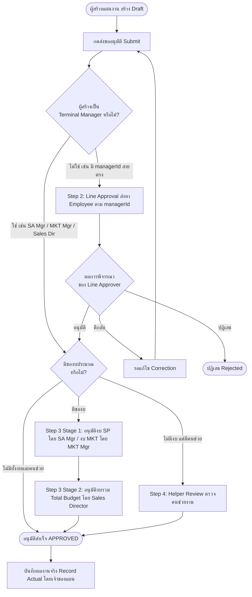

# Activity Plan — Roles & Permissions

> **เอกสารอ้างอิงกลาง (Central Reference Document)**  
> ใช้สำหรับตรวจสอบสิทธิ์ โครงสร้าง Role และฟังก์ชันการทำงานของโมดูล Activity Plan (Trip Plan)

---

## 1. Purpose (วัตถุประสงค์)

เอกสารฉบับนี้จัดทำขึ้นเพื่อเป็น **แหล่งข้อมูลอ้างอิงกลาง (Single Source of Truth)** สำหรับตรวจสอบและกำหนดสิทธิ์การใช้งานของโมดูล **Activity Plan (Trip Plan)** ภายในระบบ CRM โดยแยกขาดออกจากโมดูลการขาย (Sales) และการตลาด (Marketing) เดิม

**ขอบเขตและข้อกำหนดการใช้งาน:**
- **ตรวจสอบสิทธิ์และหน้าที่:** ใช้ตรวจสอบว่าแต่ละ Role มีสิทธิ์ระดับใด สามารถสร้าง แก้ไข อนุมัติ หรือบันทึกผลกิจกรรมส่วนใดได้บ้าง
- **เอกสารอ้างอิงสำหรับการทดสอบ (UAT Reference):** ใช้ตรวจสอบพฤติกรรมการทำงานของระบบและผลการทดสอบ User Acceptance Testing (UAT) ในแต่ละ Scenario
- **การควบคุม Authorization ในอนาคต:** ใช้เป็นเกณฑ์ในการพัฒนาระบบความปลอดภัย การเขียน Unit/Integration Tests และการตั้งค่า Data Seed
- **ข้อกำหนดการบำรุงรักษา:** หากมีการเพิ่ม ปรับปรุง หรือเปลี่ยนแปลง Role, Permission หรือ Workflow ของ Activity Plan ในอนาคต **จะต้องปรับปรุงเอกสารฉบับนี้ให้สอดคล้องเสมอ**

---

## 2. Activity Roles (บทบาทเฉพาะของโมดูลกิจกรรม)

ระบบได้ออกแบบชุด Role สำหรับโมดูล Activity Plan โดยเฉพาะจำนวน **7 Roles** เพื่อไม่ให้สิทธิ์ของ Workflow การวางแผนกิจกรรมปะปนกับสิทธิ์งานขายหรืองานเอกสารทั่วไป:

| ลำดับ | ชื่อ Role (ภาษาไทย) | Role Slug | หน้าที่หลักในระบบ | สิทธิ์สร้างแผนงาน | สิทธิ์อนุมัติ | ส่วนที่รับผิดชอบอนุมัติ | บันทึกผลจริง (Actual) | ขอบเขตข้อมูล (Data Scope) |
| :---: | :--- | :--- | :--- | :---: | :---: | :--- | :---: | :--- |
| 1 | **พนักงานส่งเสริมการขาย-กิจกรรม** | `activity_promoter` | สร้าง/ส่งแผนงานกิจกรรมภาคสนาม และบันทึกผลงานจริง | ✅ มีสิทธิ์ | ❌ ไม่มีสิทธิ์ | - | ✅ มีสิทธิ์ | `VIEW_OWN` (เฉพาะของตนเอง) |
| 2 | **พนักงานขาย-กิจกรรม** | `activity_sales_employee` | สร้าง/ส่งแผนงานตนเอง และอนุมัติตามสายงานให้ผู้ใต้บังคับบัญชา | ✅ มีสิทธิ์ | ✅ มีสิทธิ์ | Line Approval (ผู้ใต้บังคับบัญชาตาม managerId) | ✅ มีสิทธิ์ | `VIEW_OWN` / `VIEW_TEAM` |
| 3 | **ผู้จัดการภาค-กิจกรรม** | `activity_area_manager` | สร้างแผนงานระดับภาค และอนุมัติตามสายงานให้ผู้ใต้บังคับบัญชา | ✅ มีสิทธิ์ | ✅ มีสิทธิ์ | Line Approval (ผู้ใต้บังคับบัญชาตาม managerId) | ✅ มีสิทธิ์ | `VIEW_TEAM` (ระดับภาค/ทีม) |
| 4 | **ผู้จัดการเขต-กิจกรรม** | `activity_district_manager` | สร้างแผนงานระดับเขต และอนุมัติตามสายงานให้ผู้ใต้บังคับบัญชา | ✅ มีสิทธิ์ | ✅ มีสิทธิ์ | Line Approval (ผู้ใต้บังคับบัญชาตาม managerId) | ✅ มีสิทธิ์ | `VIEW_TEAM` (ระดับเขต/ทีม) |
| 5 | **ผู้จัดการแผนกบริหารงานขาย-กิจกรรม** | `activity_sales_admin_manager` | สร้างแผนงานตนเอง + อนุมัติงบ SP + ตรวจคนช่วยงานขาย | ✅ มีสิทธิ์ | ✅ มีสิทธิ์ | Line Approval (ตาม managerId) + งบ SP + ผู้ช่วยงานฝ่ายขาย | ✅ มีสิทธิ์ | `VIEW_ALL` / `VIEW_DEPARTMENT` |
| 6 | **ผู้จัดการแผนกการตลาด-กิจกรรม** | `activity_marketing_manager` | สร้างแผนงานตนเอง + อนุมัติงบ MKT + ตรวจคนช่วยงานตลาด | ✅ มีสิทธิ์ | ✅ มีสิทธิ์ | Line Approval (ตาม managerId) + งบ MKT + ผู้ช่วยงานการตลาด | ✅ มีสิทธิ์ | `VIEW_ALL` / `VIEW_DEPARTMENT` |
| 7 | **ผู้จัดการฝ่ายขาย-กิจกรรม** | `activity_sales_director` | สร้างแผนงานระดับฝ่าย + อนุมัติงบประมาณรวมขั้นสุดท้าย | ✅ มีสิทธิ์ | ✅ มีสิทธิ์ | Line Approval (ตาม managerId) + งบประมาณรวมทั้งหมด (Final) | ✅ มีสิทธิ์ | `VIEW_ALL` (ทั้งหมดในระบบ) |

---

## 3. Permission Catalog (พจนานุกรมสิทธิ์ 18 รายการ)

รายการ Permission ทั้งหมด 18 รายการที่ใช้ควบคุมการทำงานในโมดูล Activity Plan:

### 3.1 กลุ่มการจัดการแผนงาน (Activity Plan Operations)
| Permission Key | ชื่อภาษาไทย | หน้าที่และความหมาย | ขั้นตอนใน Workflow ที่ใช้งาน |
| :--- | :--- | :--- | :--- |
| `activity_plan.view` | ดูรายการและรายละเอียดแผนงาน | สิทธิ์เข้าดูข้อมูล Trip Plan ในหน้ารายการ ปฏิทิน และหน้ารายละเอียด | ทุกขั้นตอน |
| `activity_plan.create` | สร้างแผนงานใหม่ | สิทธิ์เปิดฟอร์มและบันทึกสร้าง Trip Plan ในสถานะ Draft | Step 1: วางแผนงาน (Draft) |
| `activity_plan.edit` | แก้ไขแผนงาน | สิทธิ์แก้ไขรายละเอียดแผนงานในสถานะ Draft หรือ รอแก้ไข | Step 1 & การแก้ไขหลังตีกลับ |
| `activity_plan.submit` | ส่งแผนงานเพื่อขออนุมัติ | สิทธิ์กดส่งแผนงานเข้าสู่กระบวนการอนุมัติ (Trigger Line Approval) | ส่งแผนงาน (Submit) |
| `activity_plan.view_own` | ดูแผนงานของตนเอง | สิทธิ์การเข้าถึงและมองเห็นรายการแผนงานที่ตนเองเป็นผู้สร้าง | รายการแผนงาน / แดชบอร์ด |
| `activity_plan.view_pending` | ดูรายการรออนุมัติ | สิทธิ์เข้าถึงหน้าและแท็บ "คิวรออนุมัติ" (Approval Queue) | Step 2, 3, 4 (กระบวนการอนุมัติ) |

### 3.2 กลุ่มการอนุมัติตามสายงาน (Approval Actions)
| Permission Key | ชื่อภาษาไทย | หน้าที่และความหมาย | ขั้นตอนใน Workflow ที่ใช้งาน |
| :--- | :--- | :--- | :--- |
| `activity_plan.approve` | อนุมัติแผนงาน | สิทธิ์กดปุ่มอนุมัติแผนงานตามสายงานที่ได้รับมอบหมาย | Step 2: Line Approval |
| `activity_plan.reject` | ปฏิเสธแผนงาน | สิทธิ์ปฏิเสธแผนงานและยุติ Workflow (สถานะ Rejected) | Step 2, 3, 4 (ทุกขั้นตอนอนุมัติ) |
| `activity_plan.request_correction` | ส่งแผนงานกลับไปแก้ไข (ตีกลับ) | สิทธิ์ส่งแผนงานกลับไปให้ผู้สร้างแก้ไขข้อมูลเพิ่มเติม | Step 2, 3, 4 (ทุกขั้นตอนอนุมัติ) |

### 3.3 กลุ่มการอนุมัติงบประมาณ (Budget Approvals)
| Permission Key | ชื่อภาษาไทย | หน้าที่และความหมาย | ขั้นตอนใน Workflow ที่ใช้งาน |
| :--- | :--- | :--- | :--- |
| `activity_plan.approve_sales_promotion_budget` | อนุมัติงบส่งเสริมการขาย | ตรวจสอบและอนุมัติงบส่งเสริมการขาย (SP Budget) | Step 3: Budget Approval (Stage 1) |
| `activity_plan.approve_marketing_budget` | อนุมัติงบการตลาด | ตรวจสอบและอนุมัติงบการตลาด (Marketing Budget) | Step 3: Budget Approval (Stage 1) |
| `activity_plan.approve_total_budget` | อนุมัติงบประมาณรวมทั้งหมด | อนุมัติงบประมาณรวมขั้นสุดท้าย (Final Approval) | Step 3: Budget Approval (Stage 2) |

### 3.4 กลุ่มการตรวจสอบผู้ช่วยงาน (Helper Reviews)
| Permission Key | ชื่อภาษาไทย | หน้าที่และความหมาย | ขั้นตอนใน Workflow ที่ใช้งาน |
| :--- | :--- | :--- | :--- |
| `activity_plan.review_sales_helper` | ตรวจสอบผู้ช่วยงานฝ่ายขาย | ตรวจสอบและอนุมัติรายชื่อพนักงานฝ่ายขาย/ส่งเสริมที่มาช่วยงาน | Step 3 / Step 4: Helper Review |
| `activity_plan.review_marketing_helper` | ตรวจสอบผู้ช่วยงานการตลาด | ตรวจสอบและอนุมัติรายชื่อพนักงานการตลาดที่มาช่วยงาน | Step 3 / Step 4: Helper Review |

### 3.5 กลุ่มปฏิทินและบันทึกผลงานจริง (Calendar & Actual Work)
| Permission Key | ชื่อภาษาไทย | หน้าที่และความหมาย | ขั้นตอนใน Workflow ที่ใช้งาน |
| :--- | :--- | :--- | :--- |
| `activity_plan.view_calendar` | เข้าดูปฏิทินแผนงาน | สิทธิ์เปิดดูปฏิทินนัดหมายกิจกรรม (Activity Calendar) | ทุกขั้นตอน |
| `activity_plan.record_actual` | บันทึกผลการปฏิบัติงานจริง | สิทธิ์เปิดฟอร์มและบันทึกผลลัพธ์หลังเสร็จสิ้นกิจกรรม | หลังแผนงานได้รับอนุมัติ (Approved) |
| `activity_plan.edit_actual` | แก้ไขผลการปฏิบัติงานจริง | สิทธิ์แก้ไขข้อมูลและรูปภาพผลการปฏิบัติงานจริง | หลังการบันทึกผล |

---

## 4. Permission Matrix (ตารางแมทริกซ์สิทธิ์)

ตารางแสดงสิทธิ์การใช้งานของทั้ง 7 Roles (โดย **ผู้จัดการทุกระดับมีสิทธิ์ Create + Edit + Submit + View Own + Record/Edit Actual ได้ครบถ้วน**):

| กลุ่มสิทธิ์ / Permission Key | 1. Promoter | 2. Sales | 3. Area Mgr | 4. District Mgr | 5. Sales Admin Mgr | 6. MKT Mgr | 7. Sales Director |
| :--- | :---: | :---: | :---: | :---: | :---: | :---: | :---: |
| **Role Slug** | `activity_promoter` | `activity_sales_employee` | `activity_area_manager` | `activity_district_manager` | `activity_sales_admin_manager` | `activity_marketing_manager` | `activity_sales_director` |
| **การจัดการแผนงาน** | | | | | | | |
| `activity_plan.view` | ✅ | ✅ | ✅ | ✅ | ✅ | ✅ | ✅ |
| `activity_plan.create` | ✅ | ✅ | ✅ | ✅ | ✅ | ✅ | ✅ |
| `activity_plan.edit` | ✅ | ✅ | ✅ | ✅ | ✅ | ✅ | ✅ |
| `activity_plan.submit` | ✅ | ✅ | ✅ | ✅ | ✅ | ✅ | ✅ |
| `activity_plan.view_own` | ✅ | ✅ | ✅ | ✅ | ✅ | ✅ | ✅ |
| `activity_plan.view_pending` | ❌ | ✅ (ถ้ามีลูกทีม) | ✅ | ✅ | ✅ | ✅ | ✅ |
| **การอนุมัติตามสายงาน** | | | | | | | |
| `activity_plan.approve` (Line) | ❌ | ✅ (ตาม managerId) | ✅ (ตาม managerId) | ✅ (ตาม managerId) | ✅ (ตาม managerId) | ✅ (ตาม managerId) | ✅ (ตาม managerId) |
| `activity_plan.reject` | ❌ | ✅ | ✅ | ✅ | ✅ | ✅ | ✅ |
| `activity_plan.request_correction` | ❌ | ✅ | ✅ | ✅ | ✅ | ✅ | ✅ |
| **การอนุมัติงบประมาณ** | | | | | | | |
| `activity_plan.approve_sales_promotion_budget` | ❌ | ❌ | ❌ | ❌ | ✅ (งบ SP) | ❌ | ❌ |
| `activity_plan.approve_marketing_budget` | ❌ | ❌ | ❌ | ❌ | ❌ | ✅ (งบ MKT) | ❌ |
| `activity_plan.approve_total_budget` | ❌ | ❌ | ❌ | ❌ | ❌ | ❌ | ✅ (งบรวม Final) |
| **การตรวจสอบคนช่วยงาน** | | | | | | | |
| `activity_plan.review_sales_helper` | ❌ | ❌ | ❌ | ❌ | ✅ (ช่วยงานขาย) | ❌ | ❌ |
| `activity_plan.review_marketing_helper` | ❌ | ❌ | ❌ | ❌ | ❌ | ✅ (ช่วยงานตลาด) | ❌ |
| **ปฏิทินและผลงานจริง** | | | | | | | |
| `activity_plan.view_calendar` | ✅ | ✅ | ✅ | ✅ | ✅ | ✅ | ✅ |
| `activity_plan.record_actual` | ✅ | ✅ | ✅ | ✅ | ✅ | ✅ | ✅ |
| `activity_plan.edit_actual` | ✅ | ✅ | ✅ | ✅ | ✅ | ✅ | ✅ |
| **ขอบเขตข้อมูล (`data.activity_plans`)** | **VIEW_OWN** | **VIEW_OWN / TEAM** | **VIEW_TEAM** | **VIEW_TEAM** | **VIEW_ALL / DEPT** | **VIEW_ALL / DEPT** | **VIEW_ALL** |

---

## 5. Role Capability Summary (สรุปความสามารถรายบทบาท)

### 5.1 พนักงานส่งเสริมการขาย-กิจกรรม (`activity_promoter`)
- **สามารถ:**
  - สร้างแผนงานกิจกรรม (Trip Plan)
  - แก้ไขแผนงานของตนเองในสถานะแบบร่าง (Draft) หรือรอแก้ไข (Waiting for Correction)
  - ส่งแผนงานเพื่อขออนุมัติตามสายงาน (Submit to Line Approval)
  - ดูรายการแผนงานและปฏิทินกิจกรรมของตนเอง
  - บันทึกผลการปฏิบัติงานจริง (Record Actual) สำหรับแผนงานที่ได้รับการอนุมัติแล้ว
  - แก้ไขผลการปฏิบัติงานจริงของตนเอง
- **ไม่สามารถ:**
  - อนุมัติตามสายงาน (Line Approval)
  - อนุมัติงบประมาณทุกประเภท
  - ตรวจสอบ/อนุมัติผู้ช่วยงาน
  - ดูแผนงานของผู้อื่นนอกเหนือจากแผนที่ตนเองมีส่วนร่วม

---

### 5.2 พนักงานขาย-กิจกรรม (`activity_sales_employee`)
- **บทบาทคู่ขนาน:** **เป็นทั้ง Creator และ Line Approver (สำหรับผู้ใต้บังคับบัญชาที่ระบุตนเองใน managerId)**
- **สามารถ:**
  - สร้าง แก้ไข ส่ง และดูแผนงานของตนเอง
  - ดูคิวรออนุมัติสำหรับแผนงานที่พนักงานส่งเสริมการขาย (Promoter) หรือลูกทีมที่ชี้ `managerId` มายังตนเองส่งขึ้นมา
  - อนุมัติ ปฏิเสธ หรือตีกลับแผนงานของลูกทีมในสายงาน (Step 2: Line Approval)
  - เข้าดูปฏิทินกิจกรรมของตนเองและทีม
  - บันทึกผลและแก้ไขผลการปฏิบัติงานจริงของตนเอง
- **ไม่สามารถ:**
  - อนุมัติงบประมาณ (SP / MKT / Total Budget)
  - ตรวจสอบ/อนุมัติผู้ช่วยงานระดับแผนก

---

### 5.3 ผู้จัดการภาค-กิจกรรม (`activity_area_manager`)
- **บทบาทคู่ขนาน:** **เป็นทั้ง Creator และ Line Approver (สำหรับผู้ใต้บังคับบัญชาที่ระบุตนเองใน managerId)**
- **สามารถ:**
  - สร้าง แก้ไข ส่ง และดูแผนงานกิจกรรมระดับภาคของตนเอง
  - ดูคิวรออนุมัติของพนักงานที่ชี้ `managerId` มายังตนเอง
  - อนุมัติ ปฏิเสธ หรือตีกลับแผนงานของผู้ใต้บังคับบัญชาตามสายงานจริง (Line Approval)
  - เข้าดูปฏิทินกิจกรรมระดับภาค/ทีม
  - บันทึกผลและแก้ไขผลงานจริงสำหรับแผนงานที่ตนเองเป็นผู้สร้าง
- **ไม่สามารถ:**
  - อนุมัติงบประมาณส่งเสริมการขายหรือการตลาด (งบจะไหลต่อไปยังแผนกบริหารงานขาย/การตลาด)
  - อนุมัติผู้ช่วยงานระดับแผนก

---

### 5.4 ผู้จัดการเขต-กิจกรรม (`activity_district_manager`)
- **บทบาทคู่ขนาน:** **เป็นทั้ง Creator และ Line Approver (สำหรับผู้ใต้บังคับบัญชาที่ระบุตนเองใน managerId)**
- **สามารถ:**
  - สร้าง แก้ไข ส่ง และดูแผนงานกิจกรรมระดับเขตของตนเอง
  - ดูคิวรออนุมัติของพนักงานที่ชี้ `managerId` มายังตนเอง
  - อนุมัติ ปฏิเสธ หรือตีกลับแผนงานของผู้ใต้บังคับบัญชาตามสายงานจริง (Line Approval)
  - เข้าดูปฏิทินกิจกรรมระดับเขต/ทีม
  - บันทึกผลและแก้ไขผลงานจริงสำหรับแผนงานที่ตนเองเป็นผู้สร้าง
- **ไม่สามารถ:**
  - อนุมัติงบประมาณ (SP / MKT / Total Budget)
  - อนุมัติผู้ช่วยงานระดับแผนก

---

### 5.5 ผู้จัดการแผนกบริหารงานขาย-กิจกรรม (`activity_sales_admin_manager`)
- **บทบาทคู่ขนาน:** **เป็นทั้ง Creator, Line Approver (สำหรับผู้ที่ชี้ managerId มายังตนเอง), Budget Approver (งบ SP) และ Helper Reviewer (ช่วยงานขาย)**
- **สามารถ:**
  - สร้าง แก้ไข ส่ง และดูแผนงานกิจกรรมของตนเอง
  - อนุมัติตามสายงานให้พนักงานที่ชี้ `managerId` มายังตนเอง
  - ตรวจสอบและอนุมัติงบประมาณส่งเสริมการขาย (`approve_sales_promotion_budget`) ใน Step 3 Stage 1
  - ตรวจสอบและอนุมัติรายชื่อผู้ช่วยงานฝ่ายขาย (`review_sales_helper`)
  - ปฏิเสธหรือตีกลับแผนงานได้ในขั้นตอนที่ตนเองมีอำนาจรับผิดชอบ
  - ดูข้อมูลแผนงานและปฏิทินกิจกรรมทั้งหมดของฝ่ายขาย (`VIEW_ALL` หรือ `VIEW_DEPARTMENT`)
  - บันทึกผลและแก้ไขผลงานจริงสำหรับแผนงานที่ตนเองเป็นผู้สร้าง
- **ไม่สามารถ:**
  - อนุมัติงบประมาณการตลาด (MKT Budget)
  - อนุมัติงบประมาณรวมขั้นสุดท้าย (Total Budget — เป็นอำนาจของ Sales Director)

---

### 5.6 ผู้จัดการแผนกการตลาด-กิจกรรม (`activity_marketing_manager`)
- **บทบาทคู่ขนาน:** **เป็นทั้ง Creator, Line Approver (สำหรับผู้ที่ชี้ managerId มายังตนเอง), Budget Approver (งบ MKT) และ Helper Reviewer (ช่วยงานตลาด)**
- **สามารถ:**
  - สร้าง แก้ไข ส่ง และดูแผนงานกิจกรรมทางการตลาดของตนเอง
  - อนุมัติตามสายงานให้พนักงานที่ชี้ `managerId` มายังตนเอง (เช่น ทีมการตลาด)
  - ตรวจสอบและอนุมัติงบประมาณการตลาด (`approve_marketing_budget`) ใน Step 3 Stage 1
  - ตรวจสอบและอนุมัติรายชื่อผู้ช่วยงานการตลาด (`review_marketing_helper`)
  - ปฏิเสธหรือตีกลับแผนงานได้ในขั้นตอนที่ตนเองมีอำนาจรับผิดชอบ
  - ดูข้อมูลแผนงานและปฏิทินกิจกรรมทั้งหมดของแผนกการตลาด
  - บันทึกผลและแก้ไขผลงานจริงสำหรับแผนงานที่ตนเองเป็นผู้สร้าง
- **ไม่สามารถ:**
  - อนุมัติงบประมาณส่งเสริมการขาย (SP Budget)
  - อนุมัติงบประมาณรวมขั้นสุดท้าย (Total Budget — เป็นอำนาจของ Sales Director)

---

### 5.7 ผู้จัดการฝ่ายขาย-กิจกรรม (`activity_sales_director`)
- **บทบาทคู่ขนาน:** **เป็นทั้ง Creator, Line Approver (สายตรง) และ Final Total Budget Approver**
- **สามารถ:**
  - สร้าง แก้ไข ส่ง และดูแผนงานกิจกรรมระดับนโยบายของตนเอง
  - อนุมัติตามสายงานให้ผู้ใต้บังคับบัญชาสายตรงที่ชี้ `managerId` มายังตนเอง
  - อนุมัติงบประมาณรวมขั้นสุดท้าย (`approve_total_budget`) ใน Step 3 Stage 2 (หลังจากงบ SP และ MKT ผ่านการอนุมัติครบแล้ว)
  - ดูข้อมูลแผนงานและปฏิทินกิจกรรมทั้งหมดในระบบแบบองค์รวม (`VIEW_ALL`)
  - บันทึกผลและแก้ไขผลงานจริงสำหรับแผนงานที่ตนเองเป็นผู้สร้าง
- **ไม่สามารถ:**
  - อนุมัติข้ามขั้นตอน Stage 1 หากงบ SP หรือ MKT ยังไม่ได้รับการอนุมัติจากผู้จัดการแผนกที่เกี่ยวข้อง

---

## 6. Data Scope (ขอบเขตการมองเห็นข้อมูล)

การกำหนดระดับการเข้าถึงข้อมูลตาม Resource `data.activity_plans` ใน [lib/data-scope.ts](file:///d:/code/crm-bank/lib/data-scope.ts):

| Role Slug | Data Access Level | ขอบเขตข้อมูลที่มองเห็น | เงื่อนไขการ Query ใน Database |
| :--- | :--- | :--- | :--- |
| `activity_promoter` | `VIEW_OWN` | เฉพาะแผนที่ตนเองสร้าง | `where.employeeId = session.user.employeeId` หรือ `createdById = user.id` |
| `activity_sales_employee` | `VIEW_OWN` / `VIEW_TEAM` | แผนของตนเอง + แผนของลูกทีมในสังกัด | `where.employeeId IN [own, ...subordinates]` |
| `activity_area_manager` | `VIEW_TEAM` | แผนงานของทุกคนในสายการบังคับบัญชาตามโครงสร้าง | `where.employeeId IN teamEmployeeIds` (สายการบังคับบัญชา) |
| `activity_district_manager` | `VIEW_TEAM` | แผนงานของทุกคนในสายการบังคับบัญชาตามโครงสร้าง | `where.employeeId IN teamEmployeeIds` |
| `activity_sales_admin_manager` | `VIEW_ALL` / `VIEW_DEPARTMENT` | แผนงานทั้งหมดในแผนกบริหารงานขาย / ฝ่ายขาย | `where.employee.department.code = 'SA'` หรือดูได้ทั้งหมด |
| `activity_marketing_manager` | `VIEW_ALL` / `VIEW_DEPARTMENT` | แผนงานทั้งหมดของแผนกการตลาด / มีงบตลาด | `where.employee.department.code = 'MKT'` หรือดูได้ทั้งหมด |
| `activity_sales_director` | `VIEW_ALL` | แผนงานกิจกรรมทั้งหมดทุกแผนกในบริษัท | ไม่ติด Filter ขอบเขตข้อมูล (มองเห็น 100%) |

---

## 7. Line Approval Routing Rule (กฎการกำหนดสายอนุมัติตาม managerId)

> [!IMPORTANT]
> **กฎสำคัญสูงสุดของ Line Approval:**  
> **"ผู้อนุมัติในขั้นตอน Line Approval ให้ยึด `Employee.managerId` ของผู้สร้าง Activity Plan เป็นหลักเสมอ"**

### หลักการสำคัญ (Key Principles):
1. **ไม่กำหนดลำดับผู้อนุมัติแบบตายตัวจาก Position:** ตำแหน่งไม่ได้เป็นตัวกำหนดเส้นทางการส่งเอกสารโดยตรง
2. **ไม่ Hardcode ลำดับขั้น Position ข้าม Position:** ห้ามเขียนกฎบังคับว่าตำแหน่ง A ต้องส่งให้ตำแหน่ง B เสมอ
3. **ส่งตรงตามสายผู้บังคับบัญชาจริง:** แผนงานกิจกรรมจะถูกส่งต่อไปยัง Employee ที่ระบุอยู่ในฟิลด์ `managerId` ของผู้สร้างแผน
4. **`managerId` คือตัวกำหนดผู้อนุมัติ Line Approval:** ผู้ใดก็ตามที่มี `employee.id` ตรงกับ `managerId` ของผู้สร้าง จะทำหน้าที่เป็น `currentApproverEmployeeId` ในขั้นตอนนี้
5. **แยกบทบาทและสายบังคับบัญชาออกจากกันอย่างเด็ดขาด:**
   - **`Position`** = บอกว่า **"บุคคลนี้มีบทบาทอะไร และมีสิทธิ์ใช้งานอะไร (Role / Permission)"**
   - **`Employee.managerId`** = บอกว่า **"บุคคลนี้มีใครเป็นหัวหน้า และเมื่อส่ง Line Approval เอกสารต้องส่งไปที่ใคร"**

```
Creator (ผู้สร้างแผนงาน)
   │
   └── Employee.managerId (หัวหน้าสายตรงตามโครงสร้างองค์กรจริง)
          │
          ▼
   Current Line Approver (ผู้อนุมัติใน Step 2: Line Approval)
```

---

### ตัวอย่างกรณีศึกษาเปรียบเทียบ (Routing Scenarios):

#### กรณีที่ 1: ผู้จัดการเขตขึ้นตรงต่อผู้จัดการภาค
```
โครงสร้างองค์กร:
ผู้จัดการเขต (Creator)
    └── managerId ──► ผู้จัดการภาค

เมื่อผู้จัดการเขตสร้าง Activity Plan:
[ผู้จัดการเขต] ──(Submit)──► [ผู้จัดการภาค เป็นผู้อนุมัติ] ──(Approve)──► [ขั้นตอนงบประมาณ]
```

#### กรณีที่ 2: ผู้จัดการเขตขึ้นตรงต่อผู้จัดการแผนกบริหารงานขายโดยตรง
```
โครงสร้างองค์กร:
ผู้จัดการเขต (Creator)
    └── managerId ──► ผู้จัดการแผนกบริหารงานขาย

เมื่อผู้จัดการเขตสร้าง Activity Plan:
[ผู้จัดการเขต] ──(Submit)──► [ผู้จัดการแผนกบริหารงานขาย เป็นผู้อนุมัติ] ──(Approve)──► [ขั้นตอนงบประมาณ]
```
> **ข้อสังเกต:** ในกรณีที่ 2 นี้ **เอกสารจะต้องไม่ผ่านผู้จัดการภาค** เนื่องจากโครงสร้าง `managerId` ของผู้จัดการเขตชี้ตรงไปยังผู้จัดการแผนกบริหารงานขาย

#### กรณีที่ 3: พนักงานส่งเสริมการขายขึ้นตรงต่อพนักงานขาย หรือขึ้นตรงต่อผู้จัดการเขต
- หาก Promoter มี `managerId` ชี้ไปที่ พนักงานขาย -> แผนจะส่งให้พนักงานขายอนุมัติ
- หาก Promoter มี `managerId` ชี้ไปที่ ผู้จัดการเขตโดยตรง -> แผนจะส่งให้ผู้จัดการเขต โดยไม่ต้องผ่านพนักงานขาย

---

## 8. Workflow Responsibility (ความรับผิดชอบตามขั้นตอน Workflow)

สรุปกระบวนการไหลของแผนงานตามลำดับขั้นตอนและบทบาทความรับผิดชอบ:



### การจัดการเมื่อ Manager เป็นผู้สร้างแผนงาน:
1. **กรณีผู้สร้างมี `managerId` ชี้ไปยังผู้บังคับบัญชาเหนือตนเอง:**  
   ระบบจะกำหนดผู้อนุมัติ `currentApproverEmployeeId` ให้เป็นบุคคลตาม `managerId` นั้นเสมอ ผู้สร้างจึงไม่สามารถอนุมัติตนเองใน Line Approval ได้
2. **กรณีผู้สร้างเป็น Terminal Line Manager (เช่น ผู้จัดการแผนก หรือผู้บริหารระดับสูงที่ไม่มีหัวหน้าสายงานเหนือตนเองในสาย Line):**  
   ระบบจะถือว่าผ่านการรับรองสายงานระดับบริหารแล้ว และ **ส่งตรงเข้าสู่ขั้นตอนงบประมาณ (Budget Approval) ทันที** โดยจะมีผู้บริหารส่วนกลางและผู้จัดการฝ่ายขาย (Sales Director) เป็นผู้กำกับดูแลความถูกต้องของงบประมาณรวม

---

## 9. Existing Roles — ห้ามสับสน (Non-replacement Rule)

> [!IMPORTANT]
> **Activity Roles เป็น Role ใหม่ที่แยกขาดจาก Role เดิมของระบบ 100%**  
> การเพิ่ม Activity Roles จะ **ไม่มีการลบ ดัดแปลง หรือแทนที่ Role เดิมที่มีอยู่ในระบบ Production เด็ดขาด**

รายชื่อ Role เดิมของระบบ (Legacy & Production Core Roles):
- `administrator` : ผู้ดูแลระบบสูงสุด
- `admin` : ผู้ดูแลระบบทั่วไป
- `ceo` : ผู้บริหารสูงสุด (Read-only Executive Access)
- `sales_manager` : ผู้จัดการแผนกบริหารงานขายเดิม (สิทธิ์การขาย/เป้าหมายการขาย)
- `sales_employee` : พนักงานฝ่ายขายเดิม (สิทธิ์ออร์เดอร์ขาย/ลูกค้า)
- `sales_admin` : ธุรการขายเดิม (สิทธิ์การจัดส่ง/เอกสารขาย)
- `marketing_manager` : ผู้จัดการแผนกการตลาดเดิม
- `employee_mk` : พนักงานการตลาดเดิม
- `sales_promotion` : พนักงานส่งเสริมการขายเดิม
- `sales_promotion_supervisor` : หัวหน้างานส่งเสริมการขายเดิม
- `activity_plan_user` : Role แผนงานกิจกรรมแบบกว้างเดิม
- `activity_plan_approver` : Role ผู้อนุมัติกิจกรรมแบบกว้างเดิม
- `activity_plan_admin` : Role ผู้ดูแลแผนงานเดิม

---

## 10. Coexistence (การถือครองสิทธิ์ร่วมกัน)

ตาราง `UserRole` ของระบบเป็นแบบ Many-to-Many (`@@unique([userId, roleId])`) ดังนั้น **ผู้ใช้งาน 1 คนสามารถถือครองทั้ง Role เดิมและ Activity Role ใหม่พร้อมกันได้**:

### ตัวอย่างการกำหนดบทบาทจริง:
1. **พนักงานฝ่ายขาย (Salesperson):**
   - ถือ Role เดิม: `sales_employee` (เพื่อเปิด Order ขาย, จัดการลูกค้า, ดูยอดขาย)
   - ถือ Role ใหม่: `activity_sales_employee` (เพื่อสร้าง Trip Plan, บันทึกผลตรวจแปลง, อนุมัติแผนลูกทีม)
2. **ผู้จัดการภาค (Area Manager):**
   - ถือ Role เดิม: `sales_manager` (เพื่อดูรายงานยอดขายรวม, จัดการเป้าหมายการขายในภาค)
   - ถือ Role ใหม่: `activity_area_manager` (เพื่อสร้างแผนตรวจตลาดภาค และอนุมัติ Trip Plan ของลูกทีม)
3. **ผู้จัดการแผนกการตลาด (Marketing Manager):**
   - ถือ Role เดิม: `marketing_manager` (เพื่อดูแลงานการตลาด สินค้า และโปรโมชัน)
   - ถือ Role ใหม่: `activity_marketing_manager` (เพื่อสร้าง Event และอนุมัติงบประมาณการตลาดของกิจกรรม)

**ผลลัพธ์:** สิทธิ์ของโมดูลงานขาย ลูกค้า เครดิต และรายงานเดิมจะไม่ได้รับผลกระทบใดๆ ทั้งสิ้น

---

## 11. Authorization Notes (ข้อควรทราบด้านสถาปัตยกรรมสิทธิ์)

ระบบ Activity Workflow ใช้สถาปัตยกรรมการตรวจสอบสิทธิ์แบบ **Hybrid Authorization Model** ซึ่งมีความแตกต่างระหว่างองค์ประกอบดังนี้:

| องค์ประกอบ | บทบาทหน้าที่ในระบบ | ตัวอย่าง |
| :--- | :--- | :--- |
| **Role & Permission** | กำหนดว่า **"ทำ Action อะไรได้บ้าง"** ในเชิงสิทธิ์ของระบบ | สร้างแผนได้ (`create`), แก้ไขได้ (`edit`), มีสิทธิ์กดอนุมัติได้ (`approve`) |
| **Position** | กำหนด **"บทบาท/ตำแหน่งงาน"** สำหรับแบ่งหน้าที่ความรับผิดชอบ | ผู้จัดการภาค, ผู้จัดการเขต, ผู้จัดการแผนก |
| **Employee.managerId** | กำหนดว่า **"ใครเป็นหัวหน้าสายตรง และ Line Approval ต้องส่งไปหาใคร"** | ชี้ไปยัง `employee.id` ของผู้บังคับบัญชาจริง |
| **Department** | กำหนด **"สังกัดแผนก"** สำหรับการตรวจสอบงบเฉพาะสายงาน | ฝ่ายขาย (`SA`), การตลาด (`MKT`) |
| **Data Scope** | กำหนด **"ขอบเขตแถวข้อมูลที่มองเห็น"** ในฐานข้อมูล | `VIEW_OWN`, `VIEW_TEAM`, `VIEW_ALL` |

> [!WARNING]
> **การมี Permission Key เพียงอย่างเดียว ไม่ได้หมายความว่าจะ Bypass กระบวนการทางธุรกิจได้**  
> เช่น แม้ผู้ใช้งานจะมีสิทธิ์ `activity_plan.approve` แต่หากแผนงานนั้นไม่ได้อยู่ในขั้นตอนของตนเอง หรือ `currentApproverEmployeeId` ไม่ตรงกับ `employeeId` ของผู้ใช้งาน (ซึ่งถูกกำหนดมาจาก `managerId` ของผู้สร้าง) ระบบก็จะไม่เปิดปุ่มอนุมัติและไม่อนุญาตให้กดอนุมัติได้

---

## 12. Important Rules (กฎสำคัญในการนำไปปฏิบัติ)

1. **ผู้อนุมัติ Line Approval ต้องยึดตาม `Employee.managerId` ของผู้สร้างแผนงานเป็นหลัก:** ห้ามกำหนดสายอนุมัติแบบ Hardcode Position -> Position ตายตัวในระดับ Business Rule เด็ดขาด
2. **แยกหน้าที่ระหว่าง Position และ managerId:** `Position` กำหนดสิทธิ์/บทบาท ส่วน `managerId` กำหนดสายการส่งเอกสารอนุมัติจริง
3. **ห้ามนำ Activity Role ไปแทนที่ Role เดิมโดยอัตโนมัติ:** ให้ใช้วิธี Assign เพิ่มเติมควบคู่กับ Role เดิม
4. **ห้ามลบ Role เดิม:** Role งานขายและการตลาดเดิมยังคงถูกใช้งานในส่วนของ Sales Orders, Fulfillment, Targets และ Credit Limits
5. **Activity Roles ระดับผู้จัดการต้องมีสิทธิ์ทั้ง Creator และ Approver:** ยึดตาม Matrix ในหมวดที่ 4 โดยเคร่งครัด
6. **เอกสารนี้เป็นเกณฑ์มาตรฐานของ Activity Plan:** การสร้าง Seed Script หรือแก้ไขโค้ดต้องยึดตาราง Matrix และ Routing Rule นี้เป็นหลัก
7. **การตรวจสอบสิทธิ์การอนุมัติต้องผสาน Business Workflow เสมอ:** ต้องตรวจสอบทั้ง Permission และสถานะของแผนงานควบคู่กัน
8. **การเปลี่ยนแปลงสิทธิ์ในอนาคต:** หากมีการเพิ่มลบสิทธิ์หรือปรับ Flow จะต้องอัปเดตเอกสารฉบับนี้ด้วย
9. **หากพบความไม่สอดคล้องระหว่างเอกสารกับโค้ดจริง:** ให้ทำการตรวจสอบ (Investigate) ก่อนเสมอ และห้ามแก้ระบบโดยพลการ

---

## 13. Change Log (ประวัติการปรับปรุงเอกสาร)

| วันที่ | การเปลี่ยนแปลง | รายละเอียด | ผู้จัดทำ |
| :--- | :--- | :--- | :--- |
| **2026-09-10** | **Initial Release** | สร้างเอกสาร Activity RBAC Permission Reference อ้างอิงผล Investigation และข้อกำหนด Dual Capabilities (Creator + Approver) สำหรับผู้จัดการทุกระดับ | Antigravity AI |
| **2026-09-10** | **Line Approval Rule Update** | เพิ่ม Business Rule ชัดเจนว่า Line Approval ให้ยึด `Employee.managerId` ของผู้สร้างแผนงานเป็นหลัก ไม่ Hardcode Position -> Position พร้อมตัวอย่างกรณีศึกษา และแยกนิยามระหว่าง Role, Position, managerId | Antigravity AI |
