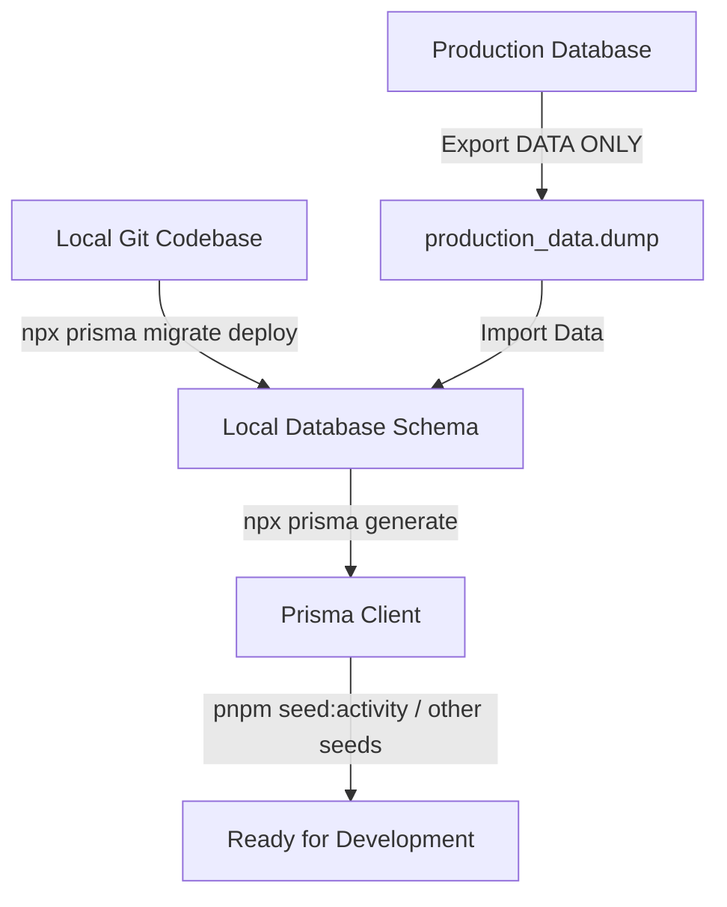

# คู่มือการจัดการ Local Database & Prisma Migration Workflow

เอกสารฉบับนี้กำหนดมาตรฐานและแนวทางการทำงานกับ Database บนสภาพแวดล้อม Local Development และการ Synchronize ข้อมูลระหว่าง Production และ Local อย่างปลอดภัย ปราศจากปัญหา Database Drift และป้องกันการสูญหายของข้อมูล

---

## 1. Local Database Architecture & Source of Truth

ในโปรเจกต์นี้ มีการแบ่งบทบาทของ Schema และ Data อย่างชัดเจน:

* **Schema Source of Truth:**
  $$\text{prisma/schema.prisma} + \text{prisma/migrations/}$$
  *โครงสร้างตาราง (Tables), คอลัมน์ (Columns), ประเภทข้อมูล (Enums), ดัชนี (Indexes), และความสัมพันธ์ (Foreign Keys) ทั้งหมดถูกควบคุมผ่านไฟล์ Migration และ `schema.prisma` บน Git เท่านั้น*
* **Production Database / Production Dump:**
  $$\text{Business Data Source Only}$$
  *ข้อมูลจริงจาก Production (Customers, Products, Sales, Shipments, etc.) มีสถานะเป็น **"ข้อมูลธุรกิจ (Data)"** เท่านั้น **ห้ามใช้เป็นตัวกำหนด Schema หรือ Migration History ของ Local***

---

## 2. Prisma Migration Policy

1. **ห้ามใช้ `npx prisma db push` ใน Development Flow หลัก:** เพราะ `db push` จะข้าม Migration History และทำให้ `_prisma_migrations` ไม่ตรงกับโครงสร้างจริง
2. **การรัน Migration บน Local:**
   * เมื่อต้องการ Apply Migration ที่มีอยู่แล้ว: ใช้ `npx prisma migrate deploy`
   * เมื่อพัฒนา Schema ใหม่และต้องการสร้าง Migration File: ใช้ `npx prisma migrate dev --name <migration_name>`
3. **การตรวจสอบสถานะ Migration:**
   * ใช้ `npx prisma migrate status` เสมอ เพื่อเช็กว่ามี Unapplied Migrations หรือ Database Drift หรือไม่

---

## 3. Workflow: การ Sync ข้อมูลจาก Production มายัง Local (ปลอดภัย 100%)

### ปัญหาที่พบบ่อย (Root Cause of Schema Drift)
เมื่อ Export ฐานข้อมูล Production มาแบบ Full Dump (`pg_dump` รวม Schema & Data):
* ตาราง `_prisma_migrations` จาก Production จะทับ `_prisma_migrations` บน Local ทำให้ Migration ของ Feature ใหม่ที่กำลังพัฒนาบน Local หายไปจากประวัติ
* ตารางและ Enums อาจถูกสร้างหรือดรอปไม่ตรงกับ Migration History ทำให้เกิด **Drift Detected**

### ขั้นตอนมาตรฐานในการ Sync ข้อมูล (Standard Operational Procedure)



#### ขั้นตอนที่ 1: Backup Local Database (ก่อนทำอะไรเสมอ)
```bash
# บน Local: สำรองฐานข้อมูล Local ไว้ก่อน
pg_dump -U postgres -h localhost -p 5432 -d crm -F c -b -v -f backup_local_before_sync.dump
```

#### ขั้นตอนที่ 2: Export ข้อมูลจาก Production แบบ Data-Only (ห้าม Dump Schema ทับ)
บน Server หรือ Container Production:
```bash
# Export เฉพาะ Data (ยกเว้น _prisma_migrations เพื่อไม่ให้ทับ Migration State ของ Local)
pg_dump -U postgres -h localhost -p 5432 -d crm \
  --data-only \
  --exclude-table=_prisma_migrations \
  --exclude-table=activity_* \
  --exclude-table=demo_* \
  -F c -b -v -f prod_data_only.dump
```

#### ขั้นตอนที่ 3: เตรียม Schema บน Local ให้เป็นปัจจุบันก่อน
บน Local เครื่องพัฒนา:
```bash
# 1. ตรวจสอบสถานะ Migration
npx prisma migrate status

# 2. นำ Migration ทั้งหมดบน Git มาใช้ให้ครบถ้วน
npx prisma migrate deploy

# 3. Generate Prisma Client
npx prisma generate
```

#### ขั้นตอนที่ 4: Import Data เข้า Local Database
```bash
# Import ข้อมูลธุรกิจเข้า Local โดยปิด Constraint ชั่วคราวระหว่าง Import
pg_restore -U postgres -h localhost -p 5432 -d crm \
  --data-only \
  --disable-triggers \
  -v prod_data_only.dump
```

#### ขั้นตอนที่ 5: รัน Seed ข้อมูลระบบและข้อมูลเสริม
```bash
# Seed Activity Types และข้อมูล Master ที่จำเป็น
pnpm seed:activity
```

---

## 4. สิ่งที่ห้ามทำโดยเด็ดขาด (Prohibited Actions)

1. ❌ **ห้ามรัน `npx prisma migrate reset` โดยเด็ดขาด** (เว้นแต่จะได้รับการอนุมัติ และมั่นใจว่าข้อมูลทั้งหมดสำรองไว้แล้ว)
2. ❌ **ห้าม Import Full Schema จาก Production มาทับ Local** หาก Production ยังไม่ได้ Apply Migration เท่ากับ Local
3. ❌ **ห้ามลบไฟล์ใน `prisma/migrations/` ทิ้งเพื่อแก้ Error**
4. ❌ **ห้ามแก้ค่าในตาราง `_prisma_migrations` แบบสุ่ม**
5. ❌ **ห้าม DROP Schema public CASCADE หรือ DROP Database**

---

## 5. การตรวจสอบและแก้ไขเมื่อเกิด Drift (Troubleshooting)

### วิธีตรวจสอบ Drift
```bash
npx prisma migrate status
```
* หากแสดง: `Database schema is up to date!` $\rightarrow$ ระบบปกติ
* หากแสดง: `Drift detected: Your database schema is not in sync with your migration history` $\rightarrow$ เกิดความไม่สอดคล้องระหว่าง Schema ใน DB กับประวัติ Migration

### วิธีแก้ไขเมื่อเกิด Drift จาก Orphaned Enums / Tables
1. **ตรวจสอบความแตกต่าง:**
   ```bash
   npx prisma migrate diff --from-config-datasource --to-schema prisma/schema.prisma
   ```
2. **ตรวจสอบ Object ที่ตกค้าง:**
   * ตรวจสอบว่ามี Enum หรือ Table ใดที่สร้างขึ้นมาลอยๆ แต่ไม่ได้ถูกบันทึกใน `_prisma_migrations`
3. **Apply Migration ให้ตรงกับ Git:**
   ```bash
   npx prisma migrate deploy
   ```
4. **ตรวจสอบความถูกต้อง:**
   ```bash
   npx prisma validate
   npx prisma generate
   npx tsc --noEmit
   ```

---

## 6. คำสั่งสำคัญประจำโปรเจกต์ (Cheatsheet)

| คำสั่ง | คำอธิบาย |
| :--- | :--- |
| `npx prisma validate` | ตรวจสอบความถูกต้องของไวยากรณ์ `schema.prisma` |
| `npx prisma generate` | สร้าง Prisma Client Type definitions |
| `npx prisma migrate status` | ตรวจสอบสถานะ Migration และตรวจจับ Drift |
| `npx prisma migrate deploy` | นำ Migration ที่ยังไม่เคยรันมาทำงานบน Database |
| `npx prisma migrate dev --name <name>` | สร้าง Migration File ใหม่จากการแก้ไข `schema.prisma` |
| `pnpm seed:activity` | Seed ข้อมูล Master Data ของโมดูลกิจกรรม (12 Activity Types) |
