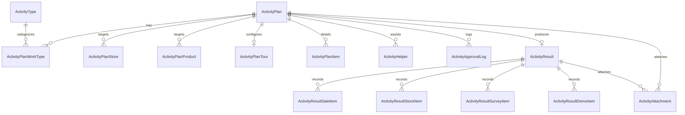

# Activity Plans (Trip Plan) Data & Feature Architecture Specification

> **Document Version:** 3.0.0 (Standardized Modular & Relational Architecture)  
> **Status:** ACTIVE STANDARD (ADOPTED SINGLE SOURCE OF TRUTH)  
> **Target Scope:** Module `modules/activity-plans/` and database models `Activity*`

---

## 1. System Overview & Architectural Paradigm

ระบบ Activity Plans (Trip Plan) ถูกออกแบบสำหรับบันทึก วางแผน อนุมัติ และติดตามผลการปฏิบัติงานของพนักงานขายและทีมส่งเสริมการเกษตร (Field Sales / Agronomists) ครอบคลุมงาน 14 ประเภทงาน (**Work Types 1–14**)

ระบบใช้สถาปัตยกรรม **Standardized Feature-Based Modular Architecture** ควบคู่กับ **Normalized Relational Data Architecture**:
1. **Planned vs Unplanned Separation**: แยก Entry Point และ Data Flow ของแผนงานล่วงหน้า (Planned) ออกจากกิจกรรมด่วน/นอกแผน (Unplanned) อย่างเป็นอิสระ
2. **Standardized Type Module Structure**: ทุก Type (TYPE 1 – 14) มีโครงสร้างโฟลเดอร์ 6 สับโฟลเดอร์เหมือนกัน และมี Pure Validation Layer ที่แยกจาก UI อย่างเด็ดขาด
3. **Decoupled Plan vs Result**: ข้อมูลแผนงาน (`ActivityPlan*`) และข้อมูลผลการปฏิบัติงานจริง (`ActivityResult*`) แยกความสัมพันธ์และโมเดลกันอย่างชัดเจน
4. **Dedicated Domain Integration**: รองรับกระบวนการเฉพาะทาง เช่น ระบบเบิกยา/เคมีภัณฑ์ (Drug Withdrawal), แปลงสาธิต (DemoPlot & DemoPlotVisit), ทัวร์ (Tour - No Actual Flow), การฉีดแปลงหลายแปลง (TYPE 13 Multi-plot Spraying), และการติดตามแปลงหลายรอบ (TYPE 14 Multi-round Follow-up)

---

## 2. Work Type Matrix & Configuration (SSOT)

ตารางประเภทงานทั้ง 14 ประเภทงาน (14 Work Types) ที่กำหนดเป็น Single Source of Truth ในระบบ:

| Work Type Code | รหัสประเภทงาน | ชื่อประเภทงาน | Has Actual | Requires Approval | Key Data Relations / Models | Dedicated Features & Workflows |
|:---|:---|:---|:---:|:---:|:---|:---|
| `TYPE_1` | TYPE 1 | เข้าพบร้านค้า / Key Farmer | **Yes** | **Yes** | 1 Store, `ActivityPlanItem` | Store Visit Topic, Qualitative Feedback |
| `TYPE_2` | TYPE 2 | ติดตามผลการใช้สินค้า | **Yes** | **Yes** | 1 Store, 1 Product, `ActivityPlanProduct` | Product Observation & Usage Feedback |
| `TYPE_3` | TYPE 3 | เสนอขายสินค้า | **Yes** | **Yes** | 1 Store, Multi Products, `ActivityPlanProduct`, `ActivityResultSaleItem` | Target vs Actual Sales, Unclosed Reason |
| `TYPE_4` | TYPE 4 | วางบิล / เก็บเงิน | **Yes** | **Yes** | 1 Store, `ActivityPlanItem` | Billing, Collection Status, Payment Verification |
| `TYPE_5` | TYPE 5 | สำรวจตลาดของคู่แข่ง | **Yes** | **Yes** | Multi Stores, Multi Products, `ActivityResultSurveyItem`, `ActivityAttachment` | Competitor Brand, Price, Promotion, Shelf Photos |
| `TYPE_6` | TYPE 6 | แก้ปัญหา / รับเรื่องร้องเรียน | **Yes** | **Yes** | 1 Store, `ActivityPlanItem`, `ActivityAttachment` | Issue Categories, Root Cause, Investigation, Resolution |
| `TYPE_7A` | TYPE 7A | ทำแปลงสาธิต (เปิดแปลงใหม่) | **Yes** | **Yes** | 1 Store, `DemoPlot`, `ActivityAttachment` | **DemoPlot Registration**, Location Coordinates, Treatment/Control Design, Drug Withdrawal |
| `TYPE_7B` | TYPE 7B | ติดตามแปลงสาธิต (แปลงเดิม) | **Yes** | **Yes** | `DemoPlotVisit`, `ActivityResultDemoItem`, `ActivityAttachment` | **DemoPlotVisit Record**, Growth Stage, Crop Age, Yield Comparison |
| `TYPE_8` | TYPE 8 | จัดประชุมการเกษตร / ดีลเลอร์ | **Yes** | **Yes** | Multi Stores, `ActivityPlanItem`, `ActivityAttachment` | Meeting Topics, Speaker, Target Attendees vs Actual Attendees |
| `TYPE_9` | TYPE 9 | จัดกิจกรรมส่งเสริมการขายหน้าร้าน | **Yes** | **Yes** | 1 Store, Multi Products, `ActivityPlanProduct`, `ActivityResultSaleItem` | Store Promotion, Target Sales vs Actual Sales, Freebies |
| `TYPE_10` | TYPE 10 | จัดงาน Field Day | **Yes** | **Yes** | Multi Stores, `ActivityPlanItem`, `ActivityResultSaleItem`, `ActivityAttachment` | Farmer Gathering, Demonstration, Booth Sales, Photos |
| `TYPE_11` | TYPE 11 | ตรวจเช็กสต็อกหน้าร้าน | **Yes** | **Yes** | Multi Stores, Multi Products, `ActivityPlanStore`, `ActivityResultStockItem` | Stock Count, Shelf Life, Low Stock Alert, Reorder Opportunity |
| `TYPE_12` | TYPE 12 | **ทัวร์ (Tour)** | **No** | **Yes** | `ActivityPlanTour` (Central / Store Tour) | **No Dedicated Actual**, Target Destination/Store, Country, Tour Size |
| `TYPE_13` | TYPE 13 | ฉีดแปลงแฮทแทค (Multi-plot) | **Yes** | **Yes** | Multi Plots (1–10 Plots), `ActivityPlanItem`, `ActivityAttachment` | **Multi-plot Spraying (1–10 plots)**, Tank Mix, Water Volume, Formula, **Drug Withdrawal Synthesis** |
| `TYPE_14` | TYPE 14 | ติดตามแปลงแฮทแทค (Multi-round) | **Yes** | **Yes** | Multi Rounds (1–5+ Rounds), `ActivityPlanItem`, `ActivityAttachment` | **Multi-round Evaluation**, Spray History linkage (from TYPE 13), **Product Groups (A: Plan, B: Supplemental, C: Actual Only)**, **Supplemental Drug Withdrawal** |

---

## 3. Standardized Feature-Based Module Architecture

แต่ละประเภทงาน (`features/type-1/` ถึง `features/type-14/`) ถูกจัดเรียงตามโครงสร้างโมดูลมาตรฐาน 6 สับโฟลเดอร์ + Types + Pure Validation Layer อย่างเคร่งครัด:

```
modules/activity-plans/features/type-[N]/
├── shared/
│   ├── types.ts                    # Module-scoped DTOs, State & Entity Types
│   ├── constants.ts                # Defaults, Dropdown options, Option Lists
│   └── index.ts                    # Re-exports for shared assets
├── create/
│   ├── components/
│   │   └── form.tsx                # Create Form Section UI Component
│   ├── validation.ts               # Pure Validation Function (returns ValidationResult)
│   └── index.ts
├── edit/
│   ├── components/
│   │   └── form.tsx                # Edit Form Section UI Component
│   └── index.ts
├── actual/
│   ├── components/
│   │   └── form.tsx                # Actual Result Entry Form UI Component
│   ├── validation.ts               # Pure Validation Function for Actual Result
│   └── index.ts                    # (Note: TYPE 12 has No Dedicated Actual)
├── detail/
│   ├── components/
│   │   └── view.tsx                # Readonly Plan & Result Summary Detail Card
│   └── index.ts
├── approval/
│   ├── components/
│   │   └── view.tsx                # Approver Decision View & Item Details
│   └── index.ts
└── index.ts                        # Canonical Public API Re-export
```

### Pure Validation Layer Contract
- ไฟล์ `create/validation.ts` และ `actual/validation.ts` ต้องเป็น **Pure Functions 100%**
- รับ Form State / Item Payload เป็น Input และคืนค่า `ValidationResult` (`{ isValid: boolean; errors: Record<string, string> }` หรือ `{ valid: boolean; errors: string[] }`)
- **ห้าม** ผูกกับ React Hooks (`useState`, `useEffect`) หรือ DOM
- ทำให้สามารถเรียกใช้ข้ามระหว่าง Client Component, React Hook Form, Server Actions, และ Automated Unit Tests ได้อย่างแม่นยำ

---

## 4. Planned vs Unplanned Architecture

ระบบรองรับสองกระบวนการหลักของการบันทึกกิจกรรม:

```mermaid
graph TD
    subgraph "Planned Flow (วางแผนล่วงหน้า)"
        P1[Planned Entry Point] --> P2[Create / Multi-Type Selection]
        P2 --> P3[Draft / Pending Approval]
        P3 --> P4[Manager / Sales Promotion Approval]
        P4 --> P5[Approved Plan]
        P5 --> P6[Record Actual Result]
        P6 --> P7[Plan & Result Completed]
    end

    subgraph "Unplanned Flow (กิจกรรมด่วน / นอกแผน)"
        U1[Unplanned Entry Point] --> U2[Quick Execution / Single Type Form]
        U2 --> U3[Simultaneous Plan & Actual Creation]
        U3 --> U4[Direct Submission / Auto-Recorded]
        U4 --> U5[Unplanned Completed Record]
    end
```



### ความแตกต่างทางสถาปัตยกรรม:
1. **Planned (`features/planned/`)**:
   - รองรับ Multi-type combination (หนึ่งแผนมีได้หลายประเภทงาน)
   - มีระบบคำนวณงบประมาณล่วงหน้า (Marketing & Sales Promotion Budgets)
   - มี State Machine ผ่านขั้นตอน Draft $\rightarrow$ Submitted $\rightarrow$ Approved $\rightarrow$ Actual In Progress $\rightarrow$ Completed
2. **Unplanned (`features/unplanned/`)**:
   - ออกแบบสำหรับหน้างานเร่งด่วน โดยกรอกข้อมูลแผนงานและผลงานจริง (Actual) พร้อมกันในขั้นตอนเดียว
   - แยก Form Component และ Validation Hook เพื่อไม่ให้กระทบ Flow การอนุมัติของ Planned

---

## 5. Domain-Specific Deep Dives

### 5.1 Tour Architecture (TYPE 12 - No Dedicated Actual)
- **Business Rule:** กิจกรรมทัวร์เป็นกิจกรรมเชิงกลยุทธ์และการท่องเที่ยวศึกษาดูงานที่**ไม่มีการบันทึกผลงานจริง (No Actual Flow)**
- `hasActual = false`
- **Database Model:** `ActivityPlanTour`
  - Central Tour (`tourType: CENTRAL`): ระบุ `tourSize` (SMALL / LARGE), `country`
  - Store Tour (`tourType: STORE`): ระบุ `storeId` (FK: Customer), `destination`
- **UI Behavior:** ไม่มีหน้า Actual Form, หน้ารายการและหน้ารายละเอียดไม่แสดงปุ่ม "บันทึกผล" และเรนเดอร์เฉพาะ `DetailType12Tour`

### 5.2 Demo Plot Architecture (TYPE 7A & TYPE 7B)
- **TYPE 7A (เปิดแปลงสาธิตใหม่):**
  - เชื่อมโยงกับโมเดล `DemoPlot`
  - บันทึกพิกัด GPS, ชนิดพืช, วันที่ปลูก, ผลิตภัณฑ์ที่ใช้, แผนการเปรียบเทียบแปลงทดลอง vs แปลงควบคุม (Treatment vs Control)
  - รองรับการเชื่อมต่อกับระบบเบิกยา (Drug Withdrawal)
- **TYPE 7B (ติดตามแปลงสาธิตเดิม):**
  - เชื่อมโยงกับโมเดล `DemoPlotVisit` และ `ActivityResultDemoItem`
  - บันทึกรอบการติดตาม, อายุพืช, ระยะการเจริญเติบโต, สภาพปัญหา, ผลตอบสนอง, และปริมาณผลผลิต (Final Yield vs Control Yield)

### 5.3 Multi-plot Spraying Architecture (TYPE 13)
- **Business Rule:** ฉีดพ่นสารเคมีแปลงแฮทแทค รองรับการบันทึกแปลงทดลองย่อย 1 ถึง 10 แปลงย่อย (Multi-plot Spraying 1–10 plots)
- แต่ละแปลงระบุขนาดพื้นที่ (ไร่/งาน), อัตราการใช้ยา, ปริมาตรน้ำ, ถังผสม, สภาพอากาศ, และกลุ่มสารเคมี
- **Drug Withdrawal Synthesis:** คำนวณและสรุปรายการสารเคมีทั้งหมดเพื่อสร้างเอกสารเบิกยา (Drug Withdrawal Slip) โดยอัตโนมัติ

### 5.4 Multi-round Follow-up & Supplemental Drug Withdrawal (TYPE 14)
- **Business Rule:** ติดตามประเมินผลแปลงแฮทแทคต่อเนื่องหลายรอบ (Round 1 ถึง 5+)
- เชื่อมโยงประวัติการฉีดพ่นจาก TYPE 13 เดิม
- **Product Classification (3 Groups):**
  - **Group A (Original Plan Products):** ยาตามแผนฉีดเดิม
  - **Group B (Supplemental Plan Products):** ยาที่ขอเบิกเพิ่มเติมตามแผน
  - **Group C (Actual Only Products):** ยาที่ใช้จริงเพิ่มเติมหน้างาน
- **Supplemental Drug Withdrawal Workflow:** มีระบบขอเบิกยาเพิ่มระหว่างรอบการติดตาม พร้อม Validation สถานะการอนุมัติและการจ่ายยา

---

## 6. Normalized Database Tables & Entity Relationships



### Summary of Normalized Relations:
1. `activity_plans`: ข้อมูลส่วนหัว วันที่ สถานที่ งบประมาณ สถานะ และผู้สร้าง
2. `activity_plan_work_types`: Bridge Table ระบุประเภทงาน (TYPE 1 – 14)
3. `activity_plan_stores`: ร้านค้าเป้าหมาย (FK $\rightarrow$ `customers`)
4. `activity_plan_products`: สินค้าและเป้าหมายยอดขาย (FK $\rightarrow$ `products`)
5. `activity_plan_tours`: ข้อมูลจำเพาะของงานทัวร์ (TYPE 12)
6. `activity_plan_items`: รายการหัวข้อ วาระการประชุม หรือข้อมูลเฉพาะงาน
7. `activity_results`: ส่วนหัวผลการปฏิบัติงานจริง (Qualitative summary, Next actions)
8. `activity_result_sale_items`: ผลยอดขายจริงรายสินค้าและสาเหตุปิดการขายไม่ได้
9. `activity_result_stock_items`: ผลการตรวจนับสต็อกหน้าร้านและโอกาสสั่งซื้อ
10. `activity_result_survey_items`: ผลการสำรวจราคาและโปรโมชั่นคู่แข่ง
11. `activity_result_demo_items`: ผลการวัดผลแปลงสาธิต ผลผลิต และความพึงพอใจ
12. `activity_attachments`: รูปภาพและเอกสารแนบแยกตามหมวดหมู่ (Shelf, Price Tag, Crop, Atmosphere)

---

## 7. Report & Dashboard SQL Readiness

ด้วยโครงสร้าง Normalized Relational Schema ระบบรองรับการออกรายงานทางธุรกิจและ Analytics Dashboard ได้ทันที 100%:

```sql
-- 1. Sales Target vs Actual Variance by Product
SELECT 
    p.name AS product_name,
    COALESCE(SUM(target.target_amount), 0) AS total_target_sales,
    COALESCE(SUM(actual.actual_total), 0) AS total_actual_sales,
    (COALESCE(SUM(actual.actual_total), 0) - COALESCE(SUM(target.target_amount), 0)) AS variance_sales
FROM products p
LEFT JOIN activity_plan_products target ON target.product_id = p.id
LEFT JOIN activity_result_sale_items actual ON actual.product_id = p.id
GROUP BY p.id, p.name
ORDER BY total_actual_sales DESC;
```

---

## 8. Architectural Integrity & Safety Rules

1. **Strict Decoupling:** การแก้ไข UI หรือ Validation ใน Type ใด ต้องไม่กระทบ Type อื่น (`features/type-[N]/` แยกขอบเขตชัดเจน)
2. **Pure Validation:** ทุกการตรวจสอบความถูกต้องของข้อมูล Form Input ต้องอยู่ใน `validation.ts` เท่านั้น
3. **No String Parsing Heuristics:** ห้ามใช้ Regex หรือข้อความใน String เพื่อวิเคราะห์ประเภทงานเด็ดขาด — ต้องอ้างอิงจาก `ActivityPlanWorkType` และ Master `ActivityType` เท่านั้น
4. **Zero Legacy References:** ห้ามนำเข้า Code หรือ Type จากไฟล์ Legacy ที่ถูก Re-export/Deprecated
